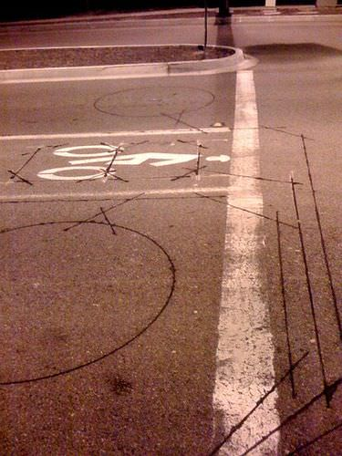
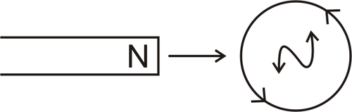
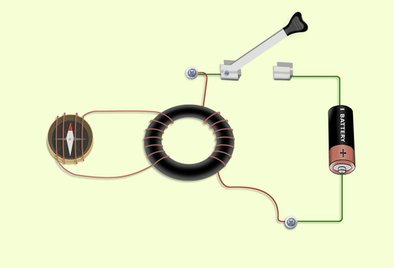
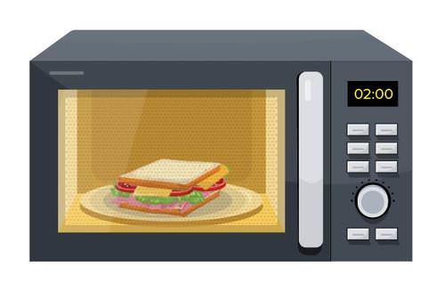

<!--
author:   Yashu Chhabra, PGT Physics, Anuradha Mathur

email:    LiaScript@web.de

version:  0.0.1

language: en

narrator: US English Female

comment:  This physics text was created using CK-12 resources to be seed content for a complete Physics Class 12 course for CBSE students.

logo:     ../cover.jpg

tags:      physics, science

-->

# CK-12 CBSE Physics Class 12

> This document was automatically translated to LiaScript from
>
> https://www.ck12.org/book/cbse_physics_book_class_xii/

## 1.0 Electric Charges and Fields

<article>

</article>

### 1.1 Introduction

<article>

### Electrostatics

Students will learn the inner workings of electrostatics: Why certain objects repulse, why certain objects attract and how to calculate the number of excess electrons or protons in an object.

#### Key Equations

$q = Ne \text{ }$ . Any object's charge is an integer multiple of an electron's charge.

> ### Guidance
> 
> * Opposite charges attract and like charges repulse
> * The electron (and proton) is the fundamental charge unit. The charge of an electron and proton is $1.6 \times 10^{-19}$ C. One can determine the number of excess electrons (or protons if positive charge) by dividing the objects charge by the fundamental charge.
> * Most objects are electrically neutral (equal numbers of electrons and protons) and that's why gravity dominates on a macro scale.

#### Example 1

**Question:**

If an object has +0.003 C of charge, how many excess protons does the object have?

**Answer:**

$q = Ne \text{ }$  $0.003 \text{C} = N \times 1.6 \times 10^{-19}$ N = $1.875 \times 10^{16}$; protons

#### Watch this Explanation

Watch the video at: https://www.youtube.com/watch?v=VdCANPLCEE8

#### Simulation

](http://phet.colorado.edu/sims/html/balloons-and-static-electricity/latest/balloons-and-static-electricity_en.html)")

#### Explore More

1. After sliding your feet across the rug, you touch the sink faucet and get shocked. Explain what is happening.

2. What is the net charge of the universe? Of your toaster?

3. As you slide your feet along the carpet, you pick up a net charge of $+4 \;\mathrm{mC}$. Which of the following is true?

a) You have an excess of $2.5 \times 10^{16}$ electrons

b) You have an excess of $2.5 \times 10^{19}$ electrons

c) You have an excess of $2.5 \times 10^{16}$ protons

d) You have an excess of $2.5 \times 10^{19}$ protons

4. You rub a glass rod with a piece of fur. If the rod now has a charge of $-0.6\ \mu C$, how many electrons have been added to the rod?

a) $3.75 \times 10^{18}$

b) $3.75 \times 10^{12}$

c) $6000$

d) $6.00 \times 10^{12}$

e) Not enough information

#### Balloons and Static Electricity

Shows how electrostatic charges interact.

http://phet.colorado.edu/sims/html/balloons-and-static-electricity/latest/balloons-and-static-electricity_en.html

### Storing Static Electricity

#### News You Can Use

* A Leyden jar consists of a glass jar that has a conducting foil (such as aluminum) that coats the inner and outer surface. A metal rod is held in place and inserted through a stopper at the top of the jar and placed so that it is in contact with the inner surface of the jar. The rod allows the inner surface to be electrically charged when the metal rod is touched with an external electric charge.
* Because it can store electrical charge, the Leyden jar serves as a basic form of a capacitor. A capacitor is a system in which two conductors (objects capable of transferring electric charge) carry equal but opposite charge. The capacitance of a typical Leyden jar is approximately 1 nano-Farad (nF). Farad (F) is the basic unit of capacitance. Capacitance ($C$) is defined as the charge of the plate ($Q$) divided by the potential difference, or voltage, between the two conductors ($V$):

$$
C=\frac{Q}{V}
$$

#### Show What You Know

1. Why is the gold leaf attracted to the hands of the person laying on the swings in the video?

2. If 88 pF capacitor is charged to 12 V, how much charge is transferred from one plate to another?

3. Given that the stored static electricity is evenly distributed across the inner foil, would you expect the electric field between the two foil surfaces (inner and outer) to be uniform or non-uniform?

</article>

### 1.2 Conductors, Insulators and Charging by Induction

<article>

### Separation and Transfer of Charge - Overview

!?[undefined](media/175094.mp4 "video")

Watch the video at: http://www.ck12.org/flx/render/embeddedobject/175094

### Forces on Charged Objects

\[Figure 1.  

Lightning is the discharge of static electricity that has built up on clouds. Every year, the earth experiences an average of 250 lakhs lightning strikes. Lightning bolts travel at speeds up to 96560 km per second, and can reach temperatures of 50,000°F, which is five times the temperature of the surface of the sun. The energy contained in a single lightning strike could light a 100 Watt light bulb 24 hours per day for 90 days.

Electric charges exist within the atom. At the turn of the 20_th_ century, J. J. Thomson and Ernest Rutherford determined that atoms contain very light-weight negatively charged particles called **electrons** and more massive, positively charged particles called **protons**.  The protons are lodged in the **nucleus** of the atoms, along with the neutrally charged particles called **neutrons,** while the electrons surround the nucleus. When the number of electrons in the electron cloud and the number of protons in the nucleus are equal, the object is said to be **neutral**. 

Changes to the nucleus of an atom require tremendous amounts of energy, so protons are not easily gained or lost by atoms. Electrons, on the other hand, are held fairly loosely and can often be removed quite easily. When an object loses some electrons, the remaining object is now positively charged because it has an excess of protons.  The electrons may either remain free or may attach to another object. In that case, the extra electrons cause that object to become negatively charged. Atoms that have lost electrons and become positively charged are called **positive** **ions,** and atoms that have gained electrons and become negatively charged are called **negative ions**.

Electrons can be removed from some objects using friction, simply by rubbing one substance against another substance. There are many examples of objects becoming charged by friction, including a rubber comb through hair, and a balloon on a sweater. In both these instances, the electrons move from the second object to the first, causing the first object to become negatively charged and the second one positively charged. Friction between the tires on a moving car and the road cause the tires to become charged, and wind causes friction between clouds and air which causes clouds to become charged and can result in tremendous bolts of lightning.

Forces are exerted on charged objects by other charged objects. You've probably heard the saying “opposites attract,” which is true in regards to charged particles. Opposite charges attract each other, while like charges repulse each other. This can be seen in the image below. When two negatively charged objects are brought near each other, a repulsive force is produced. When two positively charged objects are brought near each other, a similar repulsive force is produced. When a negatively charged object is brought near a positively charged object, an attractive force is produced. Neutral objects have no influence on each other.

If the leaves are permanently charged and the rod removed, the electroscope can then be used to determine the type of unknown charge on an object. If the electroscope has been permanently negatively charged, and a negatively charge object is brought near the knob, the leaves will separate even further, showing the new object has the same charge as the leaves. If a positively charged object is brought near a negatively charged electroscope, it will attract some of the excess electrons up the stem and out of the leaves, causing the leaves to come slightly together.

Similar to the results of a negatively charged rod, if a positively charged rod is brought near the knob of a neutral electroscope, it will attract some electrons up from the leaves onto the knob. That process causes both of the leaves to be positively charged (excess protons), and the leaves will diverge. If the positively charged rob is actually touched to the knob, the rob will remove some electrons and then when the rob is removed, the electroscope will remain positively charged. This is a permanent positive charge.

![0](media/8.png "Figure 6: Charging an object by touching it with another charged object is called **charging by conduction.** By bringing a charged object into contact with an uncharged object, some electrons will migrate to even out the charge on both objects. Charging by conduction gives the previously uncharged object a permanent charge. An uncharged object can also be charged using a method called **charging by induction**. This process allows a change in charge without actually touching the charged and uncharged objects to each other. Imagine a negatively charged rod held near the knob, but not touching. If we place a finger on the knob, some of the electrons will escape into our body, instead of down the stem and into the leaves. When both our finger and the negatively charged rod are removed, the previously uncharged electroscope now has a slight positive charge. It was charged by induction. Notice that charging by induction causes the newly charged object to have the opposite charge as the originally charged object, while charging by conduction gives them both the same charge. ")

#### Summary

* Electric charges exist with the atom.
* Atoms contain light-weight, loosely held, negatively charged particles called electrons and heavier, tightly-held, positvely charged particles called protons. 
* When the number of electrons and the number of protons are equal, the object is neutral.
* The loss of electrons gives an ion a positive charge, while the gain of electrons gives it a negative charge.
* Materials that allow electrons to flow freely are called conductors, while those that do not are called insulators.
* Opposite charges attract, and like charges repel.
* Charging an object by touching it with another charged object is called charging by conduction.

#### Practice

The following video shows a young woman placing her hands on a Van de Graf generator which then gives her a static charge. Use this resource to answer the two questions that follow.

!?[0](https://www.youtube.com/watch?v=87DqbdqBx8U)

Watch the video at: http://www.youtube.com/watch?v=87DqbdqBx8U

1. What happens to her hair when she touches a ground?    

2. What happens to her hair when she steps off the platform?

This video shows the static charge from the Van de Graf generator.

!?[0](https://www.youtube.com/watch?v=prgu6AvauuI)

Watch the video at: http://www.youtube.com/watch?v=prgu6AvauuI

This video demonstrates superconductivity that occurs at extremely low temperatures.

!?[0](https://www.youtube.com/watch?v=nWTSzBWEsms)

Watch the video at: http://www.youtube.com/watch?v=nWTSzBWEsms

#### Additional Practice Questions:

1. When a glass rod is rubbed with a silk cloth and the rod becomes positively charged,

a) electrons are removed from the rod.

b) protons are added to the silk.

c) protons are removed from the silk.

d) the silk remains neutral.

2. Electric charge is

a) found only in a conductor.

b) found only in insulators.

c) conserved.

d) not conserved.

3. When two objects are rubbed together and they become oppositely charged, they are said to be charge by

a) conduction.

b) induction.

c) friction.

d) grounding.

4. Two objects each carry a charge and they attract.  What do you know about the charge of each object?

a) They are both charged positively.

b) They have opposite charged from each other.

c) They are both charged negatively.

d) Any of the above are possible.

5. A material that easily allows the flow of electric charge through it is called a(n)

a) insulator.

b) conductor.

c) semiconductor.

d) heat sink.

6. What is the most common way of acquiring a positive static electrical charge?

a) by losing electrons

b) by gain protons

c) by losing protons

d) by gaining electrons

e) by switching positions of electrons and protons in the atom

#### Review

1. How does friction generate static electricity?

a) Friction heats the materials, thus causing electricity.

b) Rubbing materials together displaces atoms, causing sparks to fly.

c) Rubbing materials together can strip electrons off atoms, causing one material to become positive and the other to become negative.

d) Rubbing materials together causes neutrons and electrons to trade places.

e) None of the above.

2. What electrical charge does an electron have?

a) A negative charge.           

b) A positive charge.

c) A neutral charge.

d) May be any of the above.

e) None of the above.

---

3. What happens when opposite charges get close to each other?

a) They repel each other.

b) They attract each other.

c) Nothing happens.

d) They attract surrounding objects.

e) They repel surrounding objects.

4. What is an electrical conductor?

a) A material that allows electrons to travel through it freely.

b) A material that doesn’t allow electrons to travel through it freely.

c) A material that melts at low temperature.

d) A material that creates free electrons.

e) None of the above.

5. Which of the following is a good insulator of electricity?

a) Copper

b) Iron

c) Rubber

d) Salt water

e) None of these.

### Balancing Charged Spheres

#### Can You Apply It?

* When the spheres in the system are initially charged, the force between them when they are brought near one another is:

$$
F=(4 \varepsilon \pi a^2)\frac{V_1V_2}{r^2}
$$

where $a$ is the radius of each of the spheres, $V_1$ and $V_2$ are the respective initial voltages, and $r$ is the distance between the centers of the spheres. One of the spheres is attached to a torsion spring that is calibrated to measure the total angle of deflection ( $\alpha(t)$ ) from equilibrium when a torque $\tau$ is applied. The spring is tightened to bring the charged sphere back to equilibrium, at which point the angle is measured. For small displacements the torque is related to the angle by:

$$
\tau=k\theta
$$

* The torque is a result of the force that is applied to the sphere over a distance $l$, from the axis of rotation. This force takes the form of

$$
F=\frac{k}{l}\theta
$$

#### Show What You Know

1.  What relationship exists between the angle of deflection and the voltage applied to the spheres?
2.  As the distance between the charged spheres increases, what do you expect to happen to the angle of deflection?
3.  What assumption is being made about the torque equation? (Hint: Think about the angle between the force and the lever arm.)

</article>

### 1.3 Basic Properties of Charge

<article>

!?[0](https://www.youtube.com/watch?v=9rGLWKJmgTQ)

Watch the video at: https://www.youtube.com/watch?v=9rGLWKJmgTQ

</article>

### 1.4 Coulomb's Law

<article>

\[Figure 1\]

Electric cars are becoming more popular. One large advantage for electric cars is the low cost of operation, which may become an ever bigger advantage as petrol prices climb. Energy costs for electric cars average about one-third of the cost for petrol/diesel engine cars, but they can only travel about 322 km per charge at this point. These cars run using the science of electrical charges and forces.

### Coulomb’s Law

The questions regarding the relationship between the electrical force, the size of the charge, and the separation between the charges were solved by Charles Coulomb in 1785. He determined that electrical force between two charges is directly related to the size of the charges and inversely proportional to the distance between the charges. This is known as **Coulomb’s Law**.

$$
F_e=\frac{Kq_1q_2}{d^2}
$$

In this equation, _q1_ and _q2_ are the two charges, _d_ is the distance between the two charges, and _K_ is a constant of proportionality. _Fe_ is the **electric force**, which occurs as a result of interactions between two charged particles. For the purpose of calculating electric forces, we assume all charge is a **point charge**, in which the entire charge of the particle is located in a massless point.

The SI unit of charge is the coulomb, _C_, which is the charge of $6.25 \times 10^{18}$ electrons. The charge on a single electron is $1.60 \times 10^{-19} \ C$. The charge on a single electron is known as the **elementary charge**. The charge on a proton is the same magnitude but opposite in sign. When the charges are measured in coulombs, the distance in meters, and the force in Newtons, the constant _K_ is $9.0 \times 10^9 \ N \cdot m^2/C^2$.

The electrical force, like all forces, is a vector quantity. If the two charges being considered are both positive or both negative, the sign of the electrical force is positive and this force is repulsive. If the two charges are opposite in sign, the force will have a negative sign and the force is attractive.

---

**Example 1**

Object A has a positive charge of $6.0 \times 10^{-6} \ C$. Object B has a positive charge of $3.0 \times 10^{-6} \ C$. If the distance between A and B is 0.030 m, what is the force on A?

**Solution:**

**

$$
F_e=\frac{Kq_1q_2}{d^2}=\frac{(9.0 \times 10^9 \ N \cdot m^2/C^2)(6.0 \times 10^{-6} \ C)(3.0 \times 10^{-6} \ C)}{(0.030 \ m)^2}=180 \ N
$$

  
**

The positive sign of the force indicates the force is repulsive. This makes sense, because both objects have a positive charge.

**Example 2**

In the sketch below, the charges are $q_1 = 10.0 \times 10^{-6} \ C, \ q_2 = 2.0 \times 10^{-6} \ C$, and $q_3 = -6.0 \times 10^{-6} \ C$. Calculate the total force on _q2_.

\[Figure 2.  

**Solution:**

$F_e=\frac{Kq_1q_2}{d^2}=\frac{(9.0 \times 10^9 \ N \cdot m^2/C^2)(10.0 \times 10^{-6} \ C)(2.0 \times 10^{-6} \ C)}{(2.0 \ m)^2}=0.045 \ N \ (\text{towards} \ q_3)$

$F_e=\frac{Kq_2q_3}{d^2}=\frac{(9.0 \times 10^9 \ N \cdot m^2/C^2)(2.0 \times 10^{-6} \ C)(-6.0 \times 10^{-6} \ C)}{(4.0 \ m)^2}=-0.007 \ N \ (\text{towards} \ q_3)$

Since the two forces act in the same direction, their absolute values can be added together; the total force on _q2_ is 0.052 N towards _q3._

#### Summary

* Coulomb determined that electrical force between two charges is directly related to the size of the charges and inversely proportional to the distance between the charges: $F_e=\frac{Kq_1q_2}{d^2}$
* The SI unit of charge is the coulomb, _C_, which is the charge of $6.25 \times 10^{18}$ electrons.
* The charge on a single electron is $1.60 \times 10^{-19} \ C$ and is known as the elementary charge.
* The electrical force is a vector quantity that is positive in repulsion and negative in attraction.

#### Practice

The following video covers Coulomb's Law. Use this resource to answer the questions that follow.

!?[0](https://www.youtube.com/watch?v=rYjo774UpHI)

Watch the video at: http://www.youtube.com/watch?v=rYjo774UpHI

---

1. What happens when like charges are placed near each other?

2. What happens when opposite charged are placed near each other?

3. What happens to the force of attraction if the charges are placed closer together?

Practice problems on Coulomb’s Law: http://physics.info/coulomb/problems.shtml

#### Review

1. Suppose that two point charges, each with a charge of +1.00 C, are separated by a distance of 1.0 m: 

a) Will the charges attract or repel?

b) What is the magnitude of the force between them?

c) If the distance between them is doubled, what does the force become?

2. What is the electrical force between two balloons, each having 5.00 C of charge, that are 0.300 m apart?

3. Two spheres are charged with the same charge of -0.0025 C and are separated by a distance of 8.00 m.  What is the electrical force between them?

4. A red foam ball and a blue foam ball are 4.00 m apart. The blue ball has a charge of 0.000337 C and is attracting the red ball with a force of 626 N. What is the charge on the red ball?

### Coulomb’s Law

Students will learn how to solve problems involving Coulomb's Law.

#### Key Equations

$$
\begin{align*}
F = \frac{k q_1 q_2}{r^2}
\begin{cases}
k & \text{The electric constant,}\ k =  8.987 \times 10^9 \ \mathrm{N  \cdot m^2 C^{-2}}. \\
q_1, \ q_2 & \text{Magnitude of the charges, units of Coulombs (C)}\\
r & \text{Distance between charges, m}
\end{cases}
\end{align*}
$$

#### Guidance

The Coulomb Force Law states that any two charged particles $(q_1,q_2)$ --- with charge measured in units of Coulombs --- at a distance $r$ from each other will experience a force of repulsion or attraction along the line joining them equal to:

$$
\begin{align*}
\vec{F_e} &= \frac{kq_1q_2}{r^2} && \text{The Coulomb Force [1]}
\intertext{Where}
 k &= 8.987 \times 10^9 \ \mathrm{N  \cdot m^2 \cdot C^{-2}} && \text{The Electric Constant}
\end{align*}
$$

This looks a lot like the Law of Universal Gravitation, which deals with attraction between objects with mass. The big difference is that while any two masses experience mutual _attraction_, two charges can either attract or repel each other, depending on whether the signs of their charges are alike:

 forces, Coulomb forces add as vectors. Thus to find the force on a charge from an arrangement of charges, one needs to find the vector sum of the force from each charge in the arrangement.")

#### Example 1

**Question:**

Two negatively charged spheres (one with $-12\mu\mathrm{C}$; the other with $-3\mu\mathrm{C}$) are $3\mathrm{m}$ apart. Where could you place an electron so that it will be suspended in space between them with a net force of zero (for this problem we will ignore the force of repulsion between the two charges because they are held in place)?

Consider the diagram above; here $r_{s\rightarrow e}$ is the distance between the electron and the small charge, while $\vec{F}_{s\rightarrow e}$ is the force the electron feels due to it. For the electron to be balanced in between the two charges, the forces of repulsion caused by the two charges on the electron would have to be balanced. To do this, we will set the equation for the force exerted by two charges on each other equal and solve for a distance ratio. We will denote the difference between the charges through the subscripts “s” for the smaller charge, “e” for the electron, and “l” for the larger charge.

$$
\frac{kq_sq_e}{r_{s\rightarrow e}^2}=\frac{kq_lq_e}{r_{e\rightarrow l}^2}
$$

Now we can cancel. The charge of the electron cancels. The constant $k$ also cancels. We can then replace the large and small charges with the numbers. This leaves us with the distances. We can then manipulate the equation to produce a ratio of the distances.

$$
\frac{-3 \ \mu\mathrm{C}}{r_{s\rightarrow e}^2}=\frac{-12 \ \mu\mathrm{C}}{r_{e\rightarrow l}^2} \Rightarrow \frac{r_{s\rightarrow e}^2}{r_{e\rightarrow l}^2}=\frac{-12 \ \mu\mathrm{C}}{-3 \ \mu\mathrm{C}} \Rightarrow 
\frac{r_{s\rightarrow e}}{r_{e\rightarrow l}}=\sqrt{\frac{1 \ \mu\mathrm{C}}{4 \ \mu\mathrm{C}}}=\frac{1}{2}
$$

Given this ratio, we know that the electron is twice as far from the large charge ($-12\mu\mathrm{C}$) as from the small charge ($-3\mu\mathrm{C}$). Given that the distance between the small and large charges is $3\mathrm{m}$, we can determine that the electron must be located $2\mathrm{m}$ away from the large charge and $1\mathrm{m}$ away from the smaller charge.

#### Time for Practice

1. A suspended pith ball possessing $+10 \ \mu \mathrm{C}$ of charge is placed $0.02 \;\mathrm{m}$ away from a metal plate possessing $-6 \ \mu \mathrm{C}$ of charge.

a) Are these objects attracted or repulsed?

b) What is the force on the negatively charged object?

c) What is the force on the positively charged object?

2. Consider the hydrogen atom. Does the electron orbit the proton due to the force of gravity or the electric force? Calculate both forces and compare them. (You may need to look up the properties of the hydrogen atom to complete this problem.)

3. Find the direction and magnitude of the force on the charge at the origin (see picture). The object at the origin has a charge of $8 \ \mu \mathrm{C}$, the object at coordinates $(-2 \;\mathrm{m}, \ 0)$ has a charge of $12 \ \mu \mathrm{C}$, and the object at coordinates $(0, -4 \;\mathrm{m})$ has a charge of $44 \ \mu \mathrm{C}$. All distance units are in meters.

a) Draw the free body diagram for the hanging pith ball

b) Find the distance between the leftmost pith ball and the wall (this will involve working a geometry problem)

c) Find the tension in the string (Hint: use $y-$direction force balance)

d) Find the amount of charge on the pith balls (Hint: use $x-$direction force balance)

1. a) attracted

b) $1350 \;\mathrm{N}$

c) $1350 \;\mathrm{N}$

2. $F_g = 1.0  \times  10^{-47} \;\mathrm{N}$ and $F_e = 2.3 \times 10^{-8} \;\mathrm{N}$. The electric force is $39$ orders of magnitudes bigger.

3. $0.293 \;\mathrm{N}$ and at $42.5^\circ$

4. b) $0.25 \ \mathrm{m}$

c) $F_T = 0.022\;\mathrm{N}$

d) $0.37 \ \mu \mathrm{C}$

### Coulomb’s Law: Electrostatic Triangle Part I

!?[0](https://www.youtube.com/watch?v=VDJBm61v_MA)

Watch the video at: https://www.youtube.com/watch?v=VDJBm61v_MA

---

### Coulomb’s Law: Electrostatic Triangle Part II

!?[0](https://www.youtube.com/watch?v=LKaS7jLwLno)

Watch the video at: https://www.youtube.com/watch?v=LKaS7jLwLno

### Coulomb’s Law: Electrostatic Triangle Part III

!?[0](https://www.youtube.com/watch?v=w6TPj7v6-Kk)

Watch the video at: https://www.youtube.com/watch?v=w6TPj7v6-Kk

</article>

### 1.5 Principle of Superposition of Charges

<article>

!?[0](https://www.youtube.com/watch?v=anuHwHKxBSo)

Watch the video at: https://www.youtube.com/watch?v=anuHwHKxBSo

</article>

### 1.6 Electric Field and Electric Field Lines

<article>

### Electric Fields

Students will learn what an electric field is, how to draw electric field lines and how to calculate electric fields. They will also learn to apply the electric field in order to find the direction a charge would move upon entering the field and the force on it.

#### Key Equations

$E = \frac{k q}{r^2} \; \;$; Electric field due to charge $q$ at a distance _r_ from the charge.

$F = q E \; \;$; Force due to an electric field.

#### Guidance

Gravity and the Coulomb force have a nice property in common: they can be represented by **fields**. Fields are a kind of bookkeeping tool used to keep track of forces. Take the electromagnetic force between two charges given above:

$$
\vec{F_e} = \frac{kq_1q_2}{r^2}
$$

If we are interested in the acceleration of the first charge only --- due to the force from the second charge --- we can rewrite this force as the product of ${q_1}$ and $\frac{kq_2}{r^2}$. The first part of this product only depends on properties of the object we're interested in (the first charge), and the second part can be thought of as a property of the point in space where that object is.

In fact, the quantity $\frac{kq_2}{r^2}$ captures everything about the electromagnetic force on any object possible at a distance **r** from $q_2$. If we had replaced $q_1$ with a different charge, $q_3$, we would simply multiply $q_3$ by $\frac{kq_2}{r^2}$ to find the new force on the new charge. Such a quantity, $\frac{kq_2}{r^2}$ here, is referred to as the electric field from charge $q_2$ at that point: in this case, it is the electric field due to a single charge:

$$
\vec{E_f} = \frac{kq}{r^2}
$$

The electric field is a vector quantity, and points in the direction that a force felt by a positive charge at that point would. If we are given the electric field at some point, it is just a matter of multiplication --- as illustrated above --- to find the force any charge $q_0$ would feel at that point:

$$
\begin{align*}
\underbrace{\vec{F_e}}_{\text{Force on charge }q_0} = \underbrace{\vec{E_f}}_{\text{Field}} \underbrace{\times q_0}_{\text{Charge}} &&\text{Force on charge }q_0\text{ in an electric field}
\end{align*}
$$

Note that this is true for _all_ electric fields, not just those from point charges. In general, the **electric field** at a point _is the force a_ **_positive test charge of magnitude 1_** _would feel at that point_. Any other charge will feel a force along the same line (but possibly in the other direction) in proportion to its magnitude. In other words, the electric field can be thought of as “force per unit charge”.

In the case given above, the field was due to a single charge. Such a field is shown in the figure below. Notice that this a field due to a positive charge, since the field arrows are pointing outward. The field produced by a point charge will be radially symmetric i.e., the strength of the field only depends on the distance, $r$, from the charge, not the direction; the lengths of the arrows represent the strength of the field.

**Question:**

Calculate the electric field a distance of $4.0 \ \mathrm{mm}$ away from a $-2.0 \ \mu \mathrm{C}$ charge. Then, calculate the force on a $-8.0 \ \mu \mathrm{C}$ charge placed at this point.

**Answer:**

To calculate the electric field we will use the equation

$$
E=\frac{kq}{r^2}
$$

Before we solve for the electric field by plugging in the values, we convert all of the values to the same units.

$$
\begin{align*}
4.0 \ \mathrm{mm}\times \frac{1 \ \mathrm{m}}{1000 \ \mathrm{mm}}&=.004 \ \mathrm{m}\\
-2.0 \ \mu \mathrm{C}\times \frac{1 \ \mathrm{C}}{1000000 \ \mu \mathrm{C}}&=-2.0\times 10^{-6}\ \mathrm{C}
\end{align*}
$$

Now that we have consistent units we can solve the problem.

$$
E=\frac{kq}{r^2}=\frac{9 \ \times 10^9 \ \mathrm{Nm^2/C^2}\times -2.0\times 10^{-6}\ \mathrm{C}}{(.004 \ \mathrm{m})^2}=-1.1\times 10^9 \ \mathrm{N/C}
$$

To solve for the force at the point we will use the equation

$$
F=Eq
$$

We already know all of the values so all we have to do is convert all of the values to the same units and then plug in the values.

$$
\begin{align*}
\begin{array}{rcl}
-8.0 \ \mu \mathrm{C}\times \frac{1 \ \mathrm{C}}{1000000 \ \mu \mathrm{C}} &=& -8.0\times 10^{-6}\
\mathrm{C}\\
F=Eq &=& -8.0 \times 10^{-6}\ \mathrm{C} \times -1.1 \times 10^9 \ \mathrm{N/C} = 9000 \ \mathrm{N}
\end{array}
\end{align*}
$$

  

#### Watch this Explanation

!?[0](https://www.youtube.com/watch?v=5IRfbC0RHsY)

Watch the video at: https://www.youtube.com/watch?v=5IRfbC0RHsY

!?[0](https://www.youtube.com/watch?v=PssuoBBCZt4)

Watch the video at: https://www.youtube.com/watch?v=PssuoBBCZt4

#### Simulations

](http://phet.colorado.edu/sims/efield/efield_en.jnlp)")

#### Explore More

1. What is the direction of the electric field if an electron initially at rest begins to move in the North direction as a result of the field?

---

a) North

b) East

c) West

d) South

e) Not enough information

a) $A, B, C$

b) $C, B, A$

c) $B, A, C$

d) $B, C, A$

e) $A = B = C \ldots$ they’re all at the same potential

3. The three arrows shown here represent the magnitudes of the electric field and the directions at the tail end of each arrow. Consider the distribution of charges which would lead to this arrangement of electric fields. Which of the following is most likely to be the case here?

 A positive charge is located at point $A$")

b) A negative charge is located at point $B$

c) A positive charge is located at point $B$ and a negative charge is located at point $C$

d) A positive charge is located at point $A$ and a negative charge is located at point $C$

e) Both answers a) and b) are possible

---

4. Particles $A$ and $B$ are both positively charged. The arrows shown indicate the direction of the _forces_ acting on them due to an applied electric field (not shown in the picture). For each, draw in the electric field lines that would best match the observed force.

6. Copy the arrangement of charges below. Draw the electric field from the $-2 \;\mathrm{C}$ charge in one color and the electric field from the $+2 \;\mathrm{C}$ charge in a different color. Be sure to indicate the directions with arrows. Now take the individual electric field vectors, add them together, and draw the resultant vector. This is the electric field created by the two charges together.

 What is the direction of the force on the proton?")

b) Draw the electric field lines on the diagram.

c) If the electric field is $3.0 \;\mathrm{N/C}$, what is the acceleration of the proton in the region of the plates?

d) Pretend the force of gravity doesn’t exist; then sketch the path of the proton.

e) We take this whole setup to another planet. If the proton travels straight through the apparatus without deflecting, what is the acceleration of gravity on this planet?

---

8. A molecule shown by the square object shown below contains an excess of $100$ electrons.

a) What is the direction of the electric field at point A, $2.0 \times 10^{-9} \;\mathrm{m}$ away?

b) What is the value of the electric field at point $A$?

c) A molecule of charge $8.0 \ \mu \mathrm{C}$ is placed at point $A$. What are the magnitude and direction of the force acting on this molecule?

**Answers:**

1. $1.1 \times 10^9 \;\mathrm{N/C}$

2. a) down

b) Up $16c, 5.5  \times  10^{11} \;\mathrm{m/s}^2$

e) $2.9  \times  10^8 \;\mathrm{m/s}^2$

3. a) Toward the object

b) $3.6  \times  10^4 \;\mathrm{N/C}$ to the left

c) $2.8  \times  10^{-7} \;\mathrm{N}$

### High School Physics - Electric Fields

Introduces the concept of electric fields.

!?[0](https://www.youtube.com/watch?v=lpb94QF0_mM)

Watch the video at: http://www.youtube.com/watch?v=lpb94QF0_mM

### Electric Fields - Example

!?[undefined](media/175127.mp4 "video")

Watch the video at: http://www.ck12.org/flx/render/embeddedobject/175127

### Faraday Cage

#### News You Can Use

* Faraday cages are built by taking a conducting material and forming an enclosure. This conductive enclosure is able to block external electric fields. This shielding effect is possible because when an external electric field hits the Faraday cage, the electric charges within the conducting material are distributed such that they cancel the effect of the field inside the cage. While Faraday cages are used to protect electronic equipment from external electrical discharges, they are unable to block static or slowly varying magnetic fields.

* Watch the following video to see a demo of Faradays? cage: http://www.youtube.com/watch?v=WqvImbn9GG4
* Some examples of Faraday cages that are seen in everyday life are:
    * Elevators with a conducting frame
    * Microwave oven
    * The scan room that is a part of an MRI

#### Show What You Know

Using the information provided above, answer the following questions.

1. If an airplane was not shielded from a lightning strike by a Faraday cage, what would happen to the electronics of the airplane?

2. How could a Faraday cage be useful to prevent electronic eavesdropping?

</article>

### 1.7 Electric Dipole

<article>

!?[0](https://www.youtube.com/watch?v=X10kVPTfqjA)

Watch the video at: https://www.youtube.com/watch?v=X10kVPTfqjA

</article>

### 1.8 Electric Flux, Gauss Law and Applications of Gauss Law

<article>

#### Electric Flux and Gauss Law

!?[0](https://www.youtube.com/watch?v=vxasQBBlWmk)

Watch this video at: https://www.youtube.com/watch?v=vxasQBBlWmk

#### Line Charge

!?[0](https://www.youtube.com/watch?v=NyRjHj2uy6k)

Watch this video at: https://www.youtube.com/watch?v=NyRjHj2uy6k

#### Cylindrical Charge

!?[0](https://www.youtube.com/watch?v=-YfM_Wwc9UI)

Watch this video at: https://www.youtube.com/watch?v=-YfM_Wwc9UI

#### Spherical Charge

!?[0](https://www.youtube.com/watch?v=L1l9Nf1pLAc)

Watch this video at: https://www.youtube.com/watch?v=L1l9Nf1pLAc

#### Sphere with Uniform Charge

!?[0](https://www.youtube.com/watch?v=ULJTDCzKcZA)

Watch this video at: https://www.youtube.com/watch?v=ULJTDCzKcZA

#### Infinite Plane Sheet of Charge

!?[0](https://www.youtube.com/watch?v=vSEjxR56w28)

Watch this video at: https://www.youtube.com/watch?v=vSEjxR56w28

#### Cubic Gaussian Surface

!?[0](https://www.youtube.com/watch?v=MM-3sgswY9Q)

Watch this video at: https://www.youtube.com/watch?v=MM-3sgswY9Q

#### Spherical Shell

!?[0](https://www.youtube.com/watch?v=hDkfMUzFka4)

Watch this video at: https://www.youtube.com/watch?v=hDkfMUzFka4

#### Spherical Shell with Charge

!?[0](https://www.youtube.com/watch?v=zj-wo9brtVE)

Watch this video at: https://www.youtube.com/watch?v=zj-wo9brtVE

</article>

### 1.9 Self Assessments

<article>

#### Assessment 1

##### Coulomb’s Law

http://www.ck12.org/physics/Coulombs-Law/quiz/Coulombs-Law-Quiz-PPB/?referrer=concept_details

#### Assessment 2

##### Electric Field

http://www.ck12.org/physics/Electric-Fields/quiz/Electric-Fields-Quiz-PPB/?referrer=concept_details

</article>

### 1.10 Home Assignments

<article>

#### Assignment 1

##### Coulomb’s Law

http://www.ck12.org/physics/Coulombs-Law/asmtpractice/Coulombs-Law-Practice/?referrer=concept_details

#### Assignment 2

##### Electric Field

http://www.ck12.org/physics/Electric-Fields/asmtpractice/Electric-Fields-Practice/?referrer=concept_details

</article>

## 2.0 Electrostatic Potential and Capacitance

<article>

</article>

### 2.1 Electrostatic Potential

<article>

### Voltage

Students will learn the concept of Voltage and how to apply it in energy conservation problems.

#### Key Equations

$E = \frac{- \Delta V}{\Delta x} \text{ }$  Electric field vs electric potential.

$\Delta U_E = q \Delta V \text{ }$  Change in potential energy due to travel through changing voltage.

$V = \frac{k q}{r} \text{ }$  Electric potential of a single charge.

#### Guidance

Like gravity, the electric force can do work and has a potential energy associated with it. But like we use fields to keep track of electromagnetic forces, we use **electric potential**, or **voltage** to keep track of electric potential energy. So instead of looking for the potential energy of specific objects, we define it in terms of properties of the space where the objects are.

The **_electric potential difference_**_, or_ **_voltage difference_** _(often just called voltage) between two points (A and B) in the presence of an electric field is defined as the work it would take to move a_ **_positive test charge of magnitude 1_** _from the first point to the second against the electric force provided by the field_. For any other charge $q$, then, the relationship between potential difference and work will be:

$$
\begin{align*}
\Delta V_{AB} &= \frac{W_{AB}}{q} \ \ \ \ \text{[4] Electric Potential}
\intertext{Rearranging, we obtain:}
\underbrace{W}_{\text{Work}} &= \underbrace{\Delta V_{AB}}_{\text{Potential Difference}}  \times \underbrace{q}_{\text{Charge}}
\intertext{The potential of electric forces to do work corresponds to electric potential energy:}
\Delta U_{E,AB} &= q\Delta V_{AB} \ \ \text{[5] Potential energy change due to voltage change}
\end{align*}
$$

The energy that the object gains or loses when traveling through a potential difference is supplied (or absorbed) by the electric field - there is nothing else there. Therefore, it follows that _electric fields contain energy_.

To summarize: just as an electric field denotes force per unit charge, so electric potential differences represent potential energy differences _per unit charge_. Voltage is by definition the electric potential energy per Coulomb. So it is the electrical potential energy value divided by the charge. Thus, voltage difference is the potential value for potential energy. A 12 V battery can not produce energy without charge flowing (i.e. you must connect the two ends). Electric potential is measured in units of Volts $(V)$ – thus electric potential is often referred to as “voltage.” Electric potential is the source of the electric potential energy. You can read the electric potential lines (that is the voltage lines) just like you would a contour map while backpacking in the mountains. Positive charges move towards lower electric potential; negative charges move toward higher electric potential. Thus, positive charges go “downhill” and negative charges go “uphill”.

#### Example 1

You have a negative charge of unknown value and a positive charge of magnitude $q_1$ and mass $m$. After fixing the negative charge in place, you place the positive charge a distance $r_i$ away from the negative charge and then release it. If the speed of the positive charge when it is a distance $r_f$ away from the negative charge is $v$, what was the magnitude of the negative charge in terms of the given values?

**Solution:**

There are multiple ways to do this problem, we will solve it using conservation of energy and the change in voltage to determine the magnitude of the negative charge. When working through this problem, we'll call the positive charge $q_1$ and the negative charge $q_2$. To start we'll say that the charge had zero potential energy when it was 5 m from the negative charge; this will help us as we work through the problem. Using this assertion, we will apply conservation of energy to the positive charge.

$$
\begin{align*}
\Delta U_e&=KE_f && \text{start with conservation of energy}\\
q_1\Delta V&=\frac{1}{2}mv^2 && \text{substitute the equations for each energy term}\\
\Delta V&=\frac{mv^2}{2q_1} && \text{solve for V}\\
\end{align*}
$$

Now, since we know the voltage difference, we will express it using the equation for voltage at a certain distance from a point charge.

$$
\begin{align*}
\Delta V&=\frac{kq_2}{\Delta r} && \text{start with the equation for voltage at a certain distance}\\
\Delta V&=\frac{kq_2}{r_f}-\frac{kq_2}{r_i} && \text{express the change in radius in terms of the initial and final radius of the positive charge}\\
\Delta V&=kq_2(\frac{1}{r_f}-\frac{1}{r_i}) && \text{factor the equation}\\
\frac{mv^2}{2q_1}&=kq_2(\frac{1}{r_f}-\frac{1}{r_i}) && \text{substitute in the value from the first step}\\
q_2&=\frac{mv^2}{2q_1k(\frac{1}{r_f}-\frac{1}{r_i})} && \text{solve for }q_2\\
\end{align*}
$$

---

#### Watch this Explanation

!?[0](https://www.youtube.com/watch?v=UgY2-cuRUL8)

Watch the video at: https://www.youtube.com/watch?v=UgY2-cuRUL8

#### Simulation

](http://phet.colorado.edu/sims/charges-and-fields/charges-and-fields_en.html)")

#### Explore More

1. The diagram below shows a negatively charged electron. Order the electric potential lines from greatest to least.

a) $A, B, C$

b) $C, B, A$

c) $B, A, C$

d) $B, C, A$

e) $A = B = C \ldots$ they’re all at the same electric potential

a) Find the electric potential at the coordinate $(6 \;\mathrm{m}, 0)$.

b) If another metal sphere of $-3 \ \mu \mathrm{C}$ charge and mass of $20 \;\mathrm{g}$ is placed at the coordinate $(6 \;\mathrm{m}, 0)$ and left free to move, what will its speed be just before it collides with the metal sphere at the origin?

, separated by $30 \;\mathrm{cm}$, have a uniform electric field between them of $400 \;\mathrm{N/C}$.")

 Find the force on an electron located at a point midway between the plates")

b) Find the voltage difference between the two plates

c) Find the change in electric potential energy of the electron when it travels from the back plate to the front plate

d) Find the speed of the electron just before striking the front plate (the screen of your TV)

### The Electric Potential in a Uniform Field

#### Electric Potential

In the study of mechanics, the concept of energy, and the conservation thereof, was extremely useful. The same will be true for the study of electrical interactions. The work done moving a charged particle in an electric field can result in the particle gaining or losing both kinetic and potential energy.

Lifting an object in a gravitational field requires work and increases the object's potential energy. A similar situation occurs when you move two charged objects relative to each other. We already know that each object has an electric field surrounding it, which affects the other charge. If the two charged objects have the same charge, they repel each other. Moving these two objects closer to each other requires working against the repulsive force, which increases the potential energy of the system. Conversely, moving two like charges apart will decrease the potential energy. If the objects attract each other, the opposite situations occur: if you pull them apart, you do work against the force, which increases the potential energy of the system, but bringing attractive charges closer together decreases the potential energy.

It is often easy to think of the change in energy as a mountain or an inverted cone, depending on the situation. Imagine a positive point charge, with the corresponding electric field around it. If you are moving another positive point charge, the situation is like a mountain, with the original point charge at the peak. As the second charge moves towards the first, it must go up the mountain. This requires work, and increases the potential energy of the system. If, however, the second charge is a negative point charge, the two charges attract each other and the situation is like a cone: the second charge easily falls towards the first, decreasing the potential energy. It would then require work to get the second charge up and out of the cone, away from the first charge.

#### Uniform Electric Fields

As we know from Coulomb's law, the electric field around a point charge decreases as the distance from the point increases. However, it is possible to create a constant electric field between two large, flat conducting plates parallel to each other. If one of the plates is positively charged and the other negatively charged, the space between the plates will have a constant electric field except near the edges of the plates.

. To measure the voltage across some distance, it is necessary to pick a position to be the relative zero, because voltage is the change in potential difference. Any point in a system can be given the value of zero volts, but it is typically the point of a point charge or one plate in a uniform electric field as shown above. The voltage is measured using a **voltmeter,** which measures the electric potential difference across two points. ")

The electrical potential difference between the two plates is expressed as $V = Ed$, the electric field strength times the distance between the plates. The units in this expression are Newtons/coulomb times meters, which gives the final units Joules/coulomb. Voltage is an expression of the amount of potential energy per unit charge. The work done moving a charge against the field can be calculated by multiplying the electric field potential by the charge, $W = Vq$.

#### Example 1

Two large parallel metal plates are 5.0 cm apart. The magnitude of the electric field between them is $800 \ N/C$.

a) What is the potential difference between the plates?

b) What work is done when one electron is moved from the positive to the negative plate?

**Solution:**

a) $V = Ed = (800 \ N/C)(0.050 \ m) = 40 \ J/C = 40 \ V$

b) $W = Vq = (40.0 \ J/C)(1.6 \times 10^{-19} \ C) = 6.4 \times 10^{-18} \ J$

#### Example 2

A voltmeter measures the potential difference between two large parallel plates to be 50.0 volts. The plates are 3.0 cm apart. What is the magnitude of the electric field strength between the plates?

**Solution:**

$E=\frac{V}{d}=\frac{50.0 \ volts}{0.030 \ m}=1700 \ N/C$

#### Summary

* The work done moving a charged particle in an electric field can result in the particle gaining or losing both kinetic and potential energy.
* The difference in electric potential energy is measured with a voltmeter in units called volts.
* A constant electric field can be produced by placing two large flat conducting plates parallel to each other.
* The electrical potential difference in a uniform electric field is given as $V = Ed$.
* The work done moving a charge against the field can be found by $W = Vq$.

#### Practice

The following video covers potential difference and electric potential. Use this resource to answer the questions that follow.

!?[0](https://www.youtube.com/watch?v=wT9AsY79f1k)

Watch the video at: http://www.youtube.com/watch?v=wT9AsY79f1k

1. If you do work to move a charged object in an electric field, where does the work go?

2. Points A and B in an electric field have a difference in potential energy.  This difference in electrical potential energy is called \_\_\_\_\_\_\_\_\_\_\_\_\_\_\_\_\_\_\_.

Practice problems about electric potential energy with answers: http://highered.mcgraw-hill.com/sites/0072828625/student_view0/chapter12/practice_problems.html

#### Review

1. Two large parallel plates are 0.00630 m apart and the voltage across them is 10.0 volts. What is the electric field strength between the plates?

2. The potential difference between points A and B in an electric field is 25.0 volts. How much work is required to transfer 10.0 coulombs of charge from A to B?

3. 10.0 J of work are required to transfer 2.00 coulombs of charge from point X to point Y in an electric field.  What is the difference in potential between these two points?

4. The electric field between two parallel plates connected to a 45 V battery (which produces a 45 V difference in potential between the plates) is 1500 N/C. How far apart are the plates?

5. How much kinetic energy will an electron gain if it accelerates through a potential difference of 23,000 volts in a cathode ray tube?

### Electric Potential & Potential Difference

Explains the concept of electric potential energy.

!?[0](https://www.youtube.com/watch?v=wT9AsY79f1k)

Watch the video at: http://www.youtube.com/watch?v=wT9AsY79f1k

### Electrical Potential - Example 1

Solving problems involving the electric potential $(V)$ using the equation $\triangle V = \frac{ \triangle U[E]}{q}$

!?[undefined](media/160487.mp4 "video")

Watch the video at: http://www.ck12.org/flx/render/embeddedobject/160487

### Electrical Potential - Example 2

Solving problems involving the electric potential created by a point source charge $Q$ using the equation $V = \frac{kQ}{r}$

!?[undefined](media/160488.mp4 "video")

Watch the video at: http://www.ck12.org/flx/render/embeddedobject/160488

</article>

### 2.2 Electric Potential due to Point Charge, Electric Dipole

<article>

!?[0](https://www.youtube.com/watch?v=nOm6FB6p8Ko)

Watch the video at: https://www.youtube.com/watch?v=nOm6FB6p8Ko

!?[0](https://www.youtube.com/watch?v=h0wjy5qXtxc)

Watch the video at: https://www.youtube.com/watch?v=h0wjy5qXtxc

</article>

### 2.3 Equipotential Surfaces

<article>

!?[0](https://www.youtube.com/watch?v=Q22KjvxOG6U)

Watch the video at: https://www.youtube.com/watch?v=Q22KjvxOG6U

</article>

### 2.4 Potential Energy of Point Charges

<article>

!?[0](https://www.youtube.com/watch?v=elJUghWSVh4)

Watch the video at: https://www.youtube.com/watch?v=elJUghWSVh4

!?[0](https://www.youtube.com/watch?v=CqsYCIjSm9A)

Watch the video at: https://www.youtube.com/watch?v=CqsYCIjSm9A

</article>

### 2.5 Electrostatics of Conductors

<article>

!?[0](https://www.youtube.com/watch?v=dUNoxVY0p3Q)

Watch the video at: https://www.youtube.com/watch?v=dUNoxVY0p3Q

</article>

### 2.6 Capacitors

<article>

\[Figure 1\]

The circuit boards found in your computer, phone, calculator, and pretty much every other electronic device you own often look much like the one shown above. Many circuit boards have capacitors, including this one. Capacitors can be used to smooth out electrical impulses or to turn constant electric currents into a series of impulses.

#### Sharing Charge

We already know that insulators are materials that do not allow electrons to flow through them easily. When you place excess electrons on an insulator, the electrons remain where you put them and do not move around. Conversely, conductors are materials that allow electrons to flow through them freely. Since electrons repel each other, excess electrons on a conductor move to positions as far apart as possible. The difference can be seen in the image below, where the electrons on the insulator remain clumped near each other, while the electrons on the conductor have spread out to cover the whole surface.

The earth is also a conductor. Touching a charged object to the earth is called **grounding**. When you touch a conductor to the earth, you allow the earth to share the charge. Since the earth is billions of times bigger than the object, the earth takes nearly all of the charge. The charged object that was grounded now has zero charge.

Spheres, whether hollow or filled, will always have the excess charge on the surface. In hollow spheres, the only place for an electron to exist is on the surface. Similarly, in a solid conducting sphere all the excess charge sits on the surface. This conclusion is a result of Gauss's Law, which tells us that the symmetry of the sphere and the fact that the electric field within the sphere is 0 forces the charge to the outside.

#### Capacitors Store Charge

Pieter Van Musschenbroek, a Dutch physician, invented a device in 1746 that could store electric charge. Though he named the device a Leyden jar, similar devices today are called **capacitors.** A typical capacitor consists of a pair of parallel plates of area _A_ separated by a small distance _d_. The space between the two plates is most often filled with an insulator and frequently the plates are rolled into the form of a cylinder.

If voltage is applied to a capacitor, it quickly becomes charged. One of the parallel plates acquires a negative charge and the other an equal amount of positive charge. For a given capacitor, the amount of charge, _Q_, acquired by each plate is proportional to the potential difference, _V_. 

$$
Q=CV
$$

Where _Q_ is the charge in coulombs, _V_ is the voltage in volts, and _C_ is the particular capacitor's constant of proportionality. _C_ is also called the **capacitance** of the capacitor. The capacitance is the voltage the capacitor can reach before it discharges, allowing the voltage across the capacitor to drop to zero and the current to cross the capacitor. The SI unit for capacitance, according to the equation above, will be coulombs/volt, and this unit has been given the name **farad**, _F_. Most capacitors have capacitances in the range of one picofarad $(10^{-12} \ F)$ to one microfarad $(10^{-6} \ F)$.

#### Example 1

A sphere has a potential difference between it and the earth of 60.0 V when charged with $3.0 \times 10^{-6} \ C$. What is the capacitance?

**Solution:**

**$C=\frac{Q}{V}=\frac{3.0 \times 10^{-6} \ coulombs}{60.0 \ volts}=5.0 \times 10^{-8} \ farads$**

#### Summary

* Since electrons repel each other, when excess electrons are placed on a conductor, they will move to positions as far away from each other as possible.
* When a charged conductor is touched to an uncharged conductor, the electrons will migrate until the density of the charge becomes evenly distributed over the entire surface.
* Touching a charged object to the earth is called grounding.
* A charged conducting sphere will always have all the excess charge on its surface. 
* A typical capacitor consists of a pair of parallel plates, separated by a small distance.
* $Q = CV$, where _Q_ is the charge in coulombs, _V_ is the voltage in volts, and _C_ is the constant of proportionality, or capacitance.

#### Practice

The following video covers capacitors. Use this resource to answer the three questions that follow.

!?[0](https://www.youtube.com/watch?v=mmzc_ObC1dA)

Watch the video at: http://www.youtube.com/watch?v=mmzc_ObC1dA

1. What do capacitors do?

2. What are the units of capacitance?

3. What is the formula for capacitance?

Additional Practice Questions:

1. We have a large charged hollow sphere with a small hole in one side. The charge on the sphere is 1.00 C.  We insert another conducting sphere through the hole on an insulating stick and touch the inside of the charged hollow sphere and bring the second sphere outside the large sphere. What will be the charge on the second sphere?

2. Why does a charged object lose its charge when it is touched to the ground?

3. If a charged rubber rod is placed on a wooden table, the rubber rod will keep its charge for a long time. Why doesn’t the rod lose its charge immediately?

4. Both a $3.3 \times 10^{-6} \ F$ and a $6.8 \times 10^{-6} \ F$ capacitor are connected across a 15.0 V potential difference. Which capacitor has a greater charge and what is that charge?

#### Review

1. The two plates of a capacitor hold $+2.5 \times 10^{-3} \ C$ and $-2.5 \times 10^{-3} \ C$ of charge when the potential difference is 950 V. What is the capacitance?

2. The potential difference between two parallel wires in air is 120 V. They hold equal and opposite charges of $9.5 \times 10^{-11} \ C$. What is the capacitance of the two wires?

3. How much charge flows from a 12.0 V battery when it is connected to a 9.00 microfarad capacitor?

### Capacitance - Example 1

Solving problems involving the capacitance of any capacitor using the equation $C = \frac{Q}{IV}$

!?[undefined](media/160514.mp4 "video")

Watch the video at: http://www.ck12.org/flx/render/embeddedobject/160514

### Capacitance - Example 2

Solving problems involving the capacitance of parallel plate capacitors using the equation $C = \frac{ \in [0] A}{d}$

!?[undefined](media/160515.mp4 "video")

Watch the video at: http://www.ck12.org/flx/render/embeddedobject/160515

### How a Capacitor Works

Diagrams and graphics are used to explain how a capacitor works.

!?[0](https://www.youtube.com/watch?v=t9Qwx75eg8w)

Watch the video at: https://www.youtube.com/watch?v=t9Qwx75eg8w

### Capacitor Energy

Students learn how energy is stored in a capacitor and how to calculate said energy.

#### Key Equations

The electric potential energy, $U_{\text{C}}$, stored in the capacitor is given by

$$
U_{\text{C}} = \frac{1}{2}CV^2
$$

#### Guidance

Suppose we have two parallel metal plates set a distance $d$ from one another. We place a positive charge on one of the plates and a negative charge on the other. In this configuration, there will be a uniform electric field between the plates pointing from, and normal to, the plate carrying the positive charge. The magnitude of this field is given by

$$
E = \frac{V}{d}
$$

 where $V$ is the potential difference (voltage) between the two plates.

The amount of charge, $Q$, held by each plate is given by

$$
Q = CV
$$

where again $V$ is the voltage difference between the plates and $C$ is the capacitance of the plate configuration. Capacitance can be thought of as the capacity a device has for storing charge. In the parallel plate case the capacitance is given by 

$$
C = \frac{\epsilon_0 A}{d}
$$

where $A$ is the area of the plates, $d$ is the distance between the plates, and $\epsilon_0$ is the permittivity of free space whose value is $8.84 \times 10^{-12} \ C/V \cdot m$.

The electric field between the capacitor plates stores energy.

Where does this energy come from? Recall, that in our preliminary discussion of electric forces we assert that “like charges repel one another”. To build our initial configuration we had to place an excess of positive and negative charges, respectively, on each of the metal plates. Forcing these charges together on the plate had to overcome the mutual repulsion that the charges experience; this takes work. The energy used in moving the charges onto the plates gets stored in the field between the plates. It is in this way that the capacitor can be thought of as an energy storage device. This property will become more important when we study capacitors in the context of electric circuits in the next several Concepts.

Note: Many home-electronic circuits include capacitors; for this reason, it can be dangerous to mess around with old electronic components, as the capacitors may be charged even if the unit is unplugged. For example, old computer monitors (not flat screens) and TVs have capacitors that hold dangerous amounts of charge hours after the power is turned off.

#### Example 1

You have a capacitor with capacitance $100 \ \text{nF}$. If you connected it to a 12 V battery, how much energy is stored in the capacitor when it is fully charged? If you were to submerge this capacitor in water, how much energy could be stored in it?

**Solution:**

We'll just use the equation given above to calculate the energy stored on the capacitor.

$$
\begin{align*}
U_c&=\frac{1}{2}CV^2\\
U_c&=\frac{1}{2}100*10^{-9}\:\text{F}*12\:\text{V}\\
U_c&=6*10^{-7}\:\text{J}\\
\end{align*}
$$

By adding a dielectric, we increase the capacitance of the capacitor by a factor of the dielectric constant. The dielectric constant of water is 80, so the new capacitance will be 80 times the original capacitance.

$$
\begin{align*}
U_c&=\frac{1}{2}80CV^2\\
U_c&=\frac{1}{2}80*100*10^{-9}\:\text{F}*12\:\text{V}\\
U_c&=4.8*10^{-5}\:\text{J}\\
\end{align*}
$$

#### Watch this Explanation

!?[0](https://www.youtube.com/watch?v=4qwRC1Jxq8c)

Watch the video at: https://www.youtube.com/watch?v=4qwRC1Jxq8c

!?[0](https://www.youtube.com/watch?v=OVJqsJ3T9Vk)

Watch the video at: https://www.youtube.com/watch?v=OVJqsJ3T9Vk

#### Simulation

#### Explore More

1. You have a $5 \ \mu \mathrm{F}$ capacitor.

a) How much voltage would you have to apply to charge the capacitor with $200\;\mathrm{C}$ of charge?

b) Once you have finished, how much potential energy are you storing here?

c) If all this energy could be harnessed to lift 100 lbs. into the air, how high would you be lifted?

2. A certain capacitor can store $500\;\mathrm{J}$ of energy (by storing charge) if you apply a voltage of $15\;\mathrm{V}$. How many volts would you have to apply to store $1000\;\mathrm{J}$ of energy in the same capacitor? (Important: why isn’t the answer to this just $30\;\mathrm{V}$?)

3. Mayank, a bicycling physicist, wishes to harvest some of the energy he puts into turning the pedals of his bike and store this energy in a capacitor. Then, when he stops at a stop light, the charge from this capacitor can flow out and run his bicycle headlight. He is able to generate $18\;\mathrm{V}$ of electric potential, on average, by pedaling (and using magnetic induction). If Mayank wants to provide $0.5$ A of current for 60 seconds at a stop light, what should the capacitance of his capacitor be?

**Answers:**

1. a) $4 \times 10^7 \;\mathrm{V}$

b) $4 \times 10^9 \;\mathrm{J}$

c) About $9000 \;\mathrm{km}$

2. $21 \;\mathrm{V}, \;\mathrm{V}$ is squared.

3. $3.3 \;\mathrm{F}$

### Capacitors in Series and Parallel

Students will understand and apply the equations governing capacitors hooked up in series and parallel.

#### Key Equations

$$
\begin{align*}
C_{\text{parallel}} &= C_1 + C_2 + C_3 + \dots && \text{[5] Capacitors in parallel add like resistors in series}\\
\frac{1}{C_{\text{series}}} &= \frac{1}{C_1} + \frac{1}{C_2} + \frac{1}{C_3}+ \dots && \text{[6] Capacitors in series add like resistors in parallel}
\end{align*}
$$

> ### Guidance
> 
> Capacitors in parallel have the same voltage, but different charge stored. Capacitors in series have the same charge stored, but different voltages. Remember that if a capacitor are hooked up to the battery they will have the same voltage as the battery. If the capacitor is unhooked from a battery and other capacitors are attached to it, then the voltage can change but the total amount of charge must remain constant. Charge conservation holds that charge can not be created or destroyed. When solving problems involving capacitor circuits, we use the equation for the charge on a capacitor much like we use Ohm's Law.

#### Example 1

Two capacitors, one of $10 \ \mu\text{F}$ ($C_1$) and one of $60\;\mu\text{F}$ ($C_2$), are connected to a 10 V battery in series. A diagram of the circuit is shown below. Determine (a) the total capacitance, (b) the charge stored on the $100\;\mu\text{F}$ capacitor, and (c) the voltage drop across the $60\;\mu\text{F}$.

a) To find the total capacitance, we'll use the equation given above for determining the equivalent capacitance of capacitors in series.

$$
\begin{align*}
\frac{1}{C_{total}}&=\frac{1}{C_1} + \frac{1}{C_2}\\
\frac{1}{C_{total}}&=\frac{1}{100\:\mu\text{F}} + \frac{1}{60\:\mu\text{F}}\\
C_{total}&=37.5\:\mu\text{F}\\
\end{align*}
$$

b) Since charge is the same across capacitors in series, we can use the charge found using the total capacitance and the total voltage drop to find the charge in the $C_1$ capacitor.

$$
\begin{align*}
Q&=C_{total}V\\
Q&=37.5\:\mu\text{F} * 10\;\text{V}\\
Q&=375\:\mu\text{C}\\
\end{align*}
$$

c) Since we know the charge and the capacitance of $C_2$, we can find the voltage drop.

$$
\begin{align*}
Q&=C_2V_2\\
V_2&=\frac{Q}{C_2}\\
V_2&=\frac{375\:\mu\text{C}}{60\:\mu\text{F}}\\
V_2&=6.2\:\text{V}\\
\end{align*}
$$

#### Example 2

The two capacitors used in the previous example problem are now connected to the battery in parallel. What is (a) the total capacitance and (b) the charge on $C_1$. A diagram of the circuit is shown below.

\[Figure 6\]---

**Solution:**

a) To find the total capacitance, we'll use the equation given above for capacitors in parallel.

$$
\begin{align*}
C_{total}&=C_1+C_2\\
C_{total}&=100\:\mu\text{F} + 60\:\mu\text{F}\\
C_{total}&=160\:\mu\text{F}\\
\end{align*}
$$

b) Now, since the voltage across capacitors in parallel is equal, we can find the charge on $C_2$.

$$
\begin{align*}
Q_2&=C_2V\\
Q_2&=60\:\mu\text{F} * 10\:\text{V}\\
Q_2&=600\:\mu\text{C}\\
\end{align*}
$$

#### Watch this Explanation

!?[0](https://www.youtube.com/watch?v=UM3OLPVXoA8)

Watch the video at: https://www.youtube.com/watch?v=UM3OLPVXoA8

!?[0](https://www.youtube.com/watch?v=Pj9nDpsWpCA)

Watch the video at: https://www.youtube.com/watch?v=Pj9nDpsWpCA

---

#### Simulation

Note: go to the third tab to see circuits with multiple capacitors.

](http://phet.colorado.edu/sims/capacitor-lab/capacitor-lab_en.jnlp)")

#### Explore More

1. You have two $42 \  \mu \mathrm{F}$ and one $39 \  \mu \mathrm{F}$ all wired in parallel. Draw the schematic and calculate the total capacitance of the system .

2. You have two $42 \  \mu \mathrm{F}$ and one $39 \  \mu \mathrm{F}$ all wired in series. Draw the schematic and calculate the total capacitance of the system .

3. Given a capacitor with $1\;\mathrm{cm}$ between the plates a field of $20,000\;\mathrm{N/C}$ is established between the plates.

a) What is the voltage across the capacitor?

 If the charge on the plates is $1 \  \mu \mathrm{C}$, what is the capacitance of the capacitor?")

c) If two identical capacitors of this capacitance are connected in series what it the total capacitance?

d) Consider the capacitor connected in the following circuit at point $B$ with two switches $S$ and $T$, a $20 \  \Omega$ resistor and a $120\;\mathrm{V}$power source:

(i) Calculate the current through and the voltage across the resistor if $S$ is open and $T$ is closed

(ii) Repeat if $S$ is closed and $T$ is open

---

**Answers:**

1. $123 \  \mu \mathrm{F}$

2. $0.073 \  \mu \mathrm{F}$

3. a) $6 \  \mathrm{V}$

b) $0.3 \  \mathrm{A}$

c) $18 \  \mathrm{V}$

d) $3.6 \times 10^{-4} \  \mathrm{C}$

e) $3.2 \times 10^{-3} \  \mathrm{J}$

f. (i) $80  \  \mu \mathrm{F}$

(ii) $40 \  \mu \mathrm{F}$

(iii) $120 \  \mu \mathrm{F}$

</article>

### 2.7 Dielectrics

<article>

### Dielectrics - Overview

!?[undefined](media/160603.mp4 "video")

Watch the video at: http://www.ck12.org/flx/render/embeddedobject/160603

### Dielectrics - Example

Solving problems involving the dielectric constant $k$ using the equation $C \ [\text{with dielectric}]= kC \ [\text{without dielectric}]$

!?[undefined](media/160604.mp4 "video")

Watch the video at: http://www.ck12.org/flx/render/embeddedobject/160604

</article>

### 2.8 Self Assessments

<article>

#### Assessment 1

##### Voltage Quiz

http://www.ck12.org/physics/Voltage/quiz/Voltage-Quiz-PPB/?referrer=concept_details

http://www.ck12.org/physics/Voltage/quiz/The-Electric-Potential-in-a-Uniform-Field-Quiz/?referrer=concept_details

#### Assessment 2

##### Capacitors

http://www.ck12.org/physics/Capacitors/quiz/Capacitors-Quiz-PPB/?referrer=concept_details

</article>

### 2.9 Home Assignments

<article>

#### Assignment 1

##### Capacitors

http://www.ck12.org/physics/Capacitors/asmtpractice/Capacitors-Practice/?referrer=concept_details

</article>

### 2.10 Class Activities

<article>

#### Activity 1

##### Electric Potential

http://www.ck12.org/physics/Voltage/whileread/The-Electric-Potential-in-a-Uniform-Field/?referrer=concept_details

#### Activity 2

##### Capacitor Flashcards

http://www.ck12.org/physics/Capacitors/flashcard/Capacitors-Flashcards/?referrer=concept_details

</article>

### 2.11 References for Basic Understanding

<article>

#### Electric Potential

http://www.ck12.org/physics/Voltage/enrichment/Electrical-Potential-Overview/?referrer=featured_content

#### Capacitors

http://www.ck12.org/physics/Capacitors/enrichment/Capacitance-Overview/?referrer=concept_details

</article>

## 3.0 Current Electricity

<article>

</article>

### 3.1 Electric Current

<article>

#### Electric Current

Remember that it often requires work to force electrons into a specific location. If we have two conducting spheres and we have forced excess electrons onto one of the spheres by doing work on the electrons, then that sphere, and those electrons, will have a higher potential energy than those on the uncharged sphere. If the two spheres are touched together, electrons will flow from the sphere with excess electrons to the sphere with no excess electrons. That is, electrons will flow from the high potential energy position to the lower potential energy position. The flow will continue until the electrons on the two spheres have the same potential energy. A flow of charged particles such as this is called an **electric current.**

It is possible for an electric current to be either a flow of positively charged particles or negatively charged particles. In gases, both positive and negative ions can flow. The difficulty of freeing protons, however, makes it extremely rare to have an electric current of positive particles in solid conductors. Virtually all electric currents consist of the movement of electrons.

#### Common Misconceptions

It is easy to assume that current is the flow of positive charges. In fact, when the conventions of positive and negative charge were invented two centuries ago, it was assumed that positive charge flowed through a wire. In reality, however, we know now that the flow of positive charge is actually a flow of negative charge in the opposite direction. That is, when an electron moves from position A to position B, it is the same as a positive hole moving from B to A.

Today, even though we know it is not correct, we still use the historical convention of positive current flow when discussing the direction of a current. **Conventional current**, the current we commonly use and discuss, is the direction positive current would flow. When we want to speak of the direction of electron flow, we will specifically state that we are referring to electron flow.

Electric current flows from positions of higher potential energy to positions of lower potential energy. Electrons acquire higher potential energy from an electron pump that does work on the electrons, moving them from positions of lower _PE_ to positions of higher _PE_. Electrons in galvanic cells (several cells together comprise a battery) have higher potential energy at one terminal of the battery that at the other. This difference in potential is related to chemical energy. When the two terminals of the battery are connected to each other via a conducting wire, the electric current will travel from the terminal with higher potential energy to that with lower potential energy. This setup is the most simple of **electric circuits**.

#### Electric Circuits

An electric circuit is any closed loop that goes from one battery terminal to the other and allows current to flow through it. A relatively simple circuit is shown in the image below. The charges move from the higher potential energy terminal on the battery, through the light bulb, through the switch, and back to the lower potential energy terminal on the battery.

The charges in the circuit can neither be created nor destroyed, nor can they pile up in one spot. The charged particles moving through the circuit move the same everywhere in the circuit. If one coulomb of charge leaves the charge pump, then one coulomb of charge moves through the light, and one coulomb of charge moves through the switch. The net change of energy through the circuit is zero. That is, the increase in potential energy through the charge pump is exactly equal to the potential drop through the light. If the generator (charge pump) does 120 J of work on each coulomb of charge that it transfers, then the light uses 120 J of energy as the charge passes through the light.

The electric current is measured in coulombs per second. A flow of one coulomb per second is called one **ampere,** A, of current.

$$
1.00 \ \text{Ampere}=\frac{1.00 \ \text{coulomb}}{1.00 \ \text{second}}
$$

The energy carried by an electric current depends on the charge transferred and the potential difference across which it moves, $E = qV$. The voltage or potential difference is expressed in Joules/coulomb and multiplying this by the charge in coulombs yields energy in Joules.

Electrical power is a measure of 

$$
P = VI = \left(\frac{\text{Joules}}{\text{coulomb}}\right)\left(\frac{\text{coulomb}}{\text{second}}\right) = \frac{\text{Joules}}{\text{second}} = \text{watts}.
$$

the rate at which energy is transferred, and is expressed in watts, or Joules/second. Power can also be obtained by multiplying the voltage by the current: 

Power, 

#### Example 1

What is the power delivered to a light bulb when the circuit has a voltage drop of 120 V and produces a current of 3.0 ampere?

**Solution:**

$P = VI = (120 \ \text{J/C})(3.0 \ \text{C/s}) = 360 \ \text{J/s} = 360 \ \text{watts}$

#### Example 2

A 6.00 V battery delivers a 0.400 A current to an electric motor that is connected across the battery terminals. 

a) What power is consumed by the motor?

b) How much electric energy is delivered in 500 seconds?

**Solution:**

a) $P = VI = (6.00 \ \text{V})(0.400 \ \text{A}) = 2.4 \ \text{watts}$

b) $\text{Joules} = (\text{J/s})(\text{s}) = (2.4 \ \text{J/s})(500. \ \text{s}) = 1200 \ \text{Joules}$

#### Summary

* Electric current is the flow of electrons from the high potential energy position to the lower potential energy position.
* Current flow is the direction a positive current would be traveling, or the opposite direction that electrons actually flow.
* A closed loop containing current flow is called an electric circuit.
* Electric current is measured in coulombs per second, or amperes. 
* Electric energy is measured in joules per second, or watts.
* The energy carried by an electric current depends on the charge transferred and the potential difference across which it moves, $E = qV$.
* Power, $P = VI = \left(\frac{\text{Joules}}{\text{coulomb}}\right)\left(\frac{\text{coulomb}}{\text{second}}\right) = \frac{\text{Joules}}{\text{second}} = \text{watts}.$

---

#### Practice

The following video covers electric current. Use this resource to answer the questions that follow.

!?[0](https://www.youtube.com/watch?v=YNtQFSMjWLY)

Watch the video at: http://www.youtube.com/watch?v=YNtQFSMjWLY

1. What type of current is described in this video (electron or conventional)?

2. What drives the current through the circuit?

3. What inhibits the flow of current in the circuit?

The following link provides instructional material, example problems, and a quiz on electric current: http://library.thinkquest.org/10796/ch13/ch13.htm 

#### Review

1. The current through a light bulb connected across the terminals of a 120 V outlet is 0.50 A. At what rate does the bulb convert electric energy to light?

2. A 12.0 V battery causes a current of 2.0 A to flow through a lamp. What is the power used by the lamp?

3. What current flows through a 100 W light bulb connected to a 120 V outlet?

4. The current through a motor is 210 A. If a battery keeps a 12.0 V potential difference across the motor, what electric energy is delivered to the motor in 10.0 s?

### Stunning Technology

#### Why It Matters

* Stun guns are low ampere devices. Most stun guns deliver 1 to 2 milliamperes. This is significantly lower than the 1 ampere current needed to fatally injure someone.
* High voltage is needed in electroshock weapons to pass through heavy clothing and skin.
* Improper usage of these types of weapons have resulted in fatal injuries.
* Other variants of stun technology include stun belts, electroshock batons, and liquid-based electroshock weapons.

#### Explore More

Using the information provided above, answer the following questions.

1. Why do stun guns need to be low current instead of high current?

2. How can a stun gun produce 1 million volts when it is only powered by a 9-V battery?

3. Why does the voltage from a stun gun need to be high in order for it to be effective?

### Controlling Traffic In Real Time

#### News You Can Use

* Stop lights are one method of controlling the flow of traffic at major intersections. These lights work through a combination of either fixed time control or through various dynamic control methods. One of the dynamic methods employs the use of induction loops. 
* Induction loops are used to sense when a large metal object passes by. When a large enough metallic object passes by the loop (most likely an automobile), a current is induced in a nearby wire. The current then sends a signal to the traffic control unit, indicating that a car has passed by. The traffic signal can then change accordingly. 
* The principle of inductance is based on the idea that when there is a change in current within a system, an electromotive force is created in the system and any nearby conductors. The system is usually a conductor.
* An electromotive force is created in the system as well as nearby conductors due to the relationship between electromotive force and a changing magnetic flux, as well as the fact that any steady state current creates a steady magnetic field.
* The relationship between electromotive force ($\varepsilon$) and changing magnetic flux ($\phi_m$) is represented by an equation which signifies that an electromotive force is equal to the opposite of time rate of change $\left(\frac{d}{dt} \right)$ of the magnetic flux.

$$
\varepsilon = \oint \overrightarrow{E} \cdot \overrightarrow{dl} = -\frac{d}{dt}\phi _{m}
$$

The magnetic flux, $\phi _{m}$, is the magnetic field passing through a given area. This relationship indicates that an electromotive force is created in order to counteract the changing magnetic flux, thereby maintaining a steady magnetic field within a given system.

* Watch how induction is related to current: http://www.youtube.com/watch?v=tC6E9J925pY

!?[0](https://www.youtube.com/watch?v=tC6E9J925pY)

#### Explore More

Using the information provided above, answer the following questions.

1. How would the induced current be affected if a stationary magnet rather than a moving magnet was present in a loop?  

2. Rather than moving a magnet through an induction loop, could you change the strength of the magnetic field to induce a current?

3. If you were to increase the diameter of the loop seen in the video, would a current be induced?

</article>

### 3.2 Ohm's Law

<article>

### Introducing Ohm’s Law

For electric current to flow through a wire, there must be a source of voltage. Voltage is a difference in electric potential energy. As you might have guessed, greater voltage results in more current. As electric current flows through matter, particles of matter resist the moving charges. This is called resistance, and greater resistance results in less current. These relationships between electric current, voltage, and resistance were first demonstrated in the early 1800s by a German scientist named Georg Ohm, so they are referred to as Ohm’s law. **Ohm’s law** can be represented by the following equation.

$$
\text{Current(amps)} = \mathrm{\frac{Voltage(volts)}{Resistance(ohms)}}
$$

#### Understanding Ohm’s Law

Ohm’s law may be easier to understand with an analogy. Current flowing through a wire is like water flowing through a hose. Increasing voltage with a higher-volt battery increases the current. This is like opening the tap wider so more water flows through the hose. Increasing resistance reduces the current. This is like stepping on the hose so less water can flow through it. If you still aren’t sure about the relationships among current, voltage, and resistance, watch the video at this URL: http://www.youtube.com/watch?v=KvVTh3ak5dQ

!?[0](https://www.youtube.com/watch?v=KvVTh3ak5dQ)

#### Using Ohm’s Law to Calculate Current

You can use the equation for current (above) to calculate the amount of current flowing through a circuit when the voltage and resistance are known. Consider an electric wire that is connected to a 12-volt battery. If the wire has a resistance of 2 ohms, how much current is flowing through the wire?

$$
\text{Current} = \frac{120 \ \text{volts}}{2 \ \text{ohms}} = 12\ \text{amps}
$$

**Q:** If a 120-volt voltage source is connected to a wire with 10 ohms of resistance, how much current is flowing through the wire?

**A:** Substitute these values into the equation for current:

$$
\text{Current} = \frac{120 \ \text{volts}}{20 \ \text{ohms}} = 12\ \text{amps}
$$

#### Summary

* According to Ohm’s law, greater voltage results in more current and greater resistance results in less current.
* Ohm’s law can be represented by the equation:'

$$
\text{Current(amps)} = \frac{\text{Voltage(volts)}}{\text{Resistance(ohms)}}
$$

* This equation can be used to calculate current when voltage and resistance are known.

#### Vocabulary

* **Ohm’s law**: Law stating that current increases as voltage increases or resistance decreases.

#### Practice

Review Ohm’s law and how to calculate current at the following URL. Then try to solve the two problems at the bottom of the Web page. Be sure to check your answers against the correct solutions. http://www.grc.nasa.gov/WWW/k-12/Sample_Projects/Ohms_Law/ohmslaw.html

#### Review

1. State Ohm’s law.

2. An electric appliance is connected by wires to a 240-volt source of voltage. If the combined resistance of the appliance and wires is 12 ohms, how much current is flowing through the circuit?

</article>

### 3.3 Drift of Electrons and the Origin of Resistivity

<article>

Drift Velocity is the velocity attained by electrons when an external voltage is applied to them. The Following videos explain how electrons under the influence of some applied Voltage attain a velocity that depends on certain factors.

#### Drift of Electrons:

!?[0](https://www.youtube.com/watch?v=GMnt85Ejff4)

Watch the video at: https://www.youtube.com/watch?v=GMnt85Ejff4

#### Drift Velocity:

!?[0](https://www.youtube.com/watch?v=SDdsWBmckGQ)

Watch the video at: https://www.youtube.com/watch?v=SDdsWBmckGQ

### Resistivity and Conductivity

Resistivity and Conductivity are the properties of the material that help us define how easily(or with what resistive force) electrons are able to move inside a conductor. Watch the following video to learn more.

!?[0](https://www.youtube.com/watch?v=Zx8VKQbeZNI)

Watch the video at: https://www.youtube.com/watch?v=Zx8VKQbeZNI

The following simulation helps students understand how the values of Resistivity, Length and Area of Cross-Section of the conductor decide the value of Resistance offered by the conductor.

* https://phet.colorado.edu/en/simulation/resistance-in-a-wire

</article>

### 3.4 Mobility

<article>

</article>

### 3.5 Limitations of Ohm's Law

<article>

Ohm's Law gives us a overview of how a conductor behaves under an applied voltage, and how the current flows through it. Yet we observe in our daily lives that not all materials obey Ohm's Law perfectly.

http://dmr-physicsnotes.blogspot.in/2012/12/non-ohmic-devices-or-limitations-of.html

</article>

### 3.6 Resistivity of Different Materials

<article>

#### Objectives

The student will:

* Understand how to solve problems involving resistivity.
* Understand how to read the resistor code.

#### Vocabulary

* **Resistivity**: A constant of proportionality which depends upon the material used to make the wire, expressed in units $\Omega * m$.
* **Resistor:** Electric components whose only purpose is to add resistance to a circuit.
* **Semiconductors**: Materials that fall between the two extremes of conductors and insulators.  Semiconductors permit a limited amount of electron flow and are very useful in constructing electronic devices.
* **Superconductors**: Materials that lose resistance when cooled to near absolute zero.

#### Introduction

If you have ever been in an electrical supply store, you may have noticed that some wires are very thin and some are very thick. The thickness (the diameter) of a wire is called the gauge of the wire. Wires with small gauge numbers have larger diameters than wires with large gauge numbers. A 10-gauge wire is larger than a 12-gauge wire. Why do you think it is necessary to manufacture wires with different gauge?

### Resistivity

The resistance of a given wire depends upon its cross-sectional area and its length. One wire that has twice the diameter of another wire has four times the cross-sectional area of the smaller wire. It is four times easier for the electrons to travel through a wire that has twice the diameter of another wire. Conversely, the longer the wire is, the more resistance the electrons encounter. It is easier to move through a short tunnel filled with people than a long tunnel filled with people!

We can sum up these statements mathematically as follows:

The resistance $R$ is directly proportional to the length $L$ of a wire and inversely proportional to the cross-sectional area $A$ of the wire $\rightarrow R = \rho \frac{L}{A}$, where $\rho$, a constant of proportionality, is called the **resistivity** which depends upon the material used to make the wire.

The units of resistivity $\rho$ are $\Omega * m$.

A quantity called the conductivity expressed using the Greek letter sigma $\sigma$ is defined as the reciprocal of the resistivity $\sigma = \frac{1}{\rho}$. The greater the conductivity is, the smaller amount of resistance in the circuit; and therefore, the greater current in the circuit.

The resistivity is determined experimentally. When the same voltage is applied to wires of different materials, but of identical cross section and length, different currents are measured.

For example, under identical conditions, a copper wire conducts almost 60 times the current than a nichrome wire (an alloy of nickel, iron, and chromium). Which wire do you think has greater resistivity?

Table below gives resistivity values for some common conducting materials at $20^\circ C$. Resistivity values are sensitive to changes in temperature and differ for different materials.

| Material | Resistivity, $\rho \ (\Omega*m) \times 10^{-8}$ |
| --- | --- |
| Silver | 1.59 |
| Copper | 1.68 |
| Gold | 2.44 |
| Aluminum | 2.65 |
| Tungsten | 5.60 |
| Nichrome | 100 |

#### Example 1

A copper wire is to replace an aluminum wire of length _$1.20 \times 10^{-1} \ m$_ in an electrical circuit. The copper wire has a cross-sectional area which is 80% of the aluminum wire. The resistance of the circuit must remain the same. What length of copper wire must be used? Assume the temperature remains constant at $20^\circ C$ in the circuit.

**Answer:**

$R_{aluminum} = \rho_{al} \frac{L_{al}}{A_{al}}$ and $R_{copper} = \rho_c \frac{L_c}{A_c}$

Since the resistances must be equal,

$$
\begin{align*}
\rho_{al} \frac{L_{al}}{A_{al}} &= \rho_c \frac{L_c}{A_c} \rightarrow L_c = \frac{\rho_{al}}{\rho_c} \frac{A_c}{A_{al}} L_{al} \rightarrow\\
L_c &= \left(\frac{2.65 \times 10^{-8} \ \Omega*m}{1.68 \times 10^{-8} \ \Omega*m} \right) \left(\frac{0.80 \ A_{al}}{A_{al}} \right) (1.20 \times 10^{-1} \ m) = 1.514 \times 10^{-1} \ m = 1.51 \ cm
\end{align*}
$$

#### Semiconductors

As we mentioned earlier, charges move readily in conductors and do not move at all in insulators (nonconductors). There are materials, however, that fall in between these two extremes. They are called **semiconductors**. Semiconductors permit a limited amount of electron flow and are very useful in constructing electronic devices. Common semiconductors are silicon, germanium, and carbon. The resistors discussed below are often made from carbon. Semiconductors are used in the construction of electronic components such as transistors and diodes, to name just two.

#### Superconductors

In the early 20th century, it was discovered that when certain materials were cooled to near absolute zero, they lost all their resistance. Materials displaying this attribute are called **superconductors**. Superconductors hold great promise in producing devices that require much less energy since electrical resistance, as we will see in this chapter, converts a good deal of electrical energy into unwanted heat. Of course, the practical use of superconductors is very limited by the necessity to keep them at extremely low temperatures. However, some advances have been made in recent years.  Scientists have learned to manufacture materials that become superconducting at temperatures as high as $160 \ K (-113^\circ C)$.

#### Resistors

Every electrical device (and every circuit) has some amount of resistance. There are, however, circumstances when additional resistance is required in a circuit. Resistance can help protect delicate circuitry by limiting the current through a particular segment (branch) of a circuit.

In order to add the required resistance to a circuit, electronic components are made called **resistors** (adding resistance is not their only purpose). Resistors have resistances that range from one ohm to millions of ohms. Figure below shows some common resistors found in electronic equipment. The colorful bands on the resistors are a code used to designate the amount of resistance of the resistor. For example, the fifth resistor from the left in figure below has a sequence of colors: Green, Blue, Green, Silver: The first two colors represent 56 (see code) the third color represents the multiplier $\text{Green} = \times 100 \ k$. Therefore the resistor has $56 \times 100 \ k$ ohms of resistance or $5.6 \times 10^6 \ \Omega$. The last color represents the tolerance of the resistor. This is a measure of accuracy. Silver is 10%, which means that the actual resistance of the resistor lies somewhere between ten percent above to ten percent below the stated value of $5.6 \times 10^6 \ \Omega$.

$\rightarrow 5.6 \times 10^6 \ \Omega \pm (5.6 \times 10^5 \ \Omega) \rightarrow 6,160,000-5.040,000 \rightarrow 6.2 \times 10^6 \ \Omega*5.0 \times 10^6 \ \Omega$

* http://demonstrations.wolfram.com/4BandColorCodeForResistors/

Check out the Resistivity of Various Materials and decide which are must suitable as conductors.

* http://hyperphysics.phy-astr.gsu.edu/hbase/tables/rstiv.html

</article>

### 3.7 Temperature Dependence of Resistivity

<article>

</article>

### 3.8 Combination of Resistance in Series and Parallel

<article>

### Resistors in Series

Students will learn how to analyze and solve problems involving circuits with resistors in series.

#### Key Equations

$$
R_{total} = R_1 + R_2 + R_3 + \ldots
$$

#### Guidance

**Resistors in Series:** All resistors are connected end to end. There is only one river, so they all receive the same current. But since there is a voltage drop across each resistor, they may all have different voltages across them. The more resistors in series the more rocks in the river, so the less current that flows.

#### Example 1

A circuit is wired up with two resistors in series.

**Questions**

1. What is the total resistance of the circuit?

2. What is the total current coming out of the power supply?

3. How much power does the power supply dissipate?

4. How much power does each resistor dissipate?

5. How much voltage is there across each resistor?

**Answers:**

1. The total resistance is $R_{total}=R_1+R_2=90 \;\Omega+10 \;\Omega=100 \;\Omega$

2. Use Ohm’s Law $(V=IR)$ but solve for current $(I=V/R)$.

$$
I_{total}=\frac{V_{total}}{R_{total}}=\frac{20\:V}{100\:\Omega}=0.20\:A
$$

3. $P=IV$, so the total power equals the total voltage multiplied by the total current. Thus, $P_{total}=I_{total}V_{total}=(0.20\;A)(20 \ V)=4.0\;W$. So the Power Supply is outputting 4W (i.e. 4 Joules of energy per second).

4. Each resistor has different voltage across it, but the same current. So, using Ohm’s law, convert the power formula into a form that does not depend on voltage.

$$
\begin{align*}
P&=IV=I(IR)=I^2R.\\
P_{90 \:\Omega} &= I^2_{90\:\Omega}R_{90\:\Omega}=(0.2\:A)^2(90\:\Omega)=3.6\:W\\
P_{10 \:\Omega} &= I^2_{10\:\Omega}R_{10\:\Omega}=(0.2\:A)^2(10\:\Omega)=0.4\:W
\end{align*}
$$

$^*$Note: If you add up the power dissipated by each resistor, it equals the total power outputted, as it should–Energy is always conserved.

5. In order to calculate voltage across a resistor, use Ohm’s law.

$$
\begin{align*}
V_{90\:\Omega} &= I_{90\:\Omega}R_{90\:\Omega}=(0.2\:A)(90\:\Omega)=18\:V\\
V_{10\:\Omega} &= I_{10\:\Omega}R_{10\:\Omega}=(0.2\:A)(10\:\Omega)=2\:V
\end{align*}
$$

$^*$Note: If you add up the voltages across the individual resistors you will obtain the total voltage of the circuit, as you should. Further note that with the voltages we can use the original form of the Power equation $(P=IV)$, and we should get the same results as above.

$$
\begin{align*}
P_{90\:\Omega} &= I_{90\:\Omega}V_{90\:\Omega}=(18\:V)(0.2\:A)=3.6\:W\\
P_{10\:\Omega} &= I_{10\:\Omega}V_{10\:\Omega}=(2.0\:V)(0.2\:A)=0.4\:W
\end{align*}
$$

#### Watch this Explanation

Watch the video at: https://www.youtube.com/watch?v=xJ_j_swDvlo

#### Simulation

#### Explore More

1. Regarding the circuit below.

a) If the ammeter reads $2\;\mathrm{A}$, what is the voltage?

b) How many watts is the power supply supplying?

c) How many watts are dissipated in each resistor?

a) If these resistors are connected to a 6 V battery, what is the current flowing out of the battery?

b) If these resistors are connected to a 120 V power supply, what is the current flowing out of the battery?

c) In order to increase current in your circuit, which two resistors would you remove?

3. Given the resistors above and a 12 V battery, how could you make a circuit that draws 0.0594 A?

#### Answers to Selected Problems

1. a) $224 \;\mathrm{V}$ b) $448 \;\mathrm{W}$ c) $400 \;\mathrm{W}$ by $100 \ \Omega$ and $48 \;\mathrm{W}$ by $12 \ \Omega$

2. a) 0.013 A b) 0.27 A c) $120 \ \Omega$ and $180 \ \Omega$

3. Need about $202 \ \Omega$ of total resistance. So if you wire up the $120 \ \Omega$ and the $82 \ \Omega$ in series, you'll have it.

### Resistors in Parallel

Students will learn how to analyze and solve problems involving circuits with resistors in parallel.

#### Key Equations

$$
\frac{1} {R_{total}} = \frac{1} {R_1} + \frac{1}{R_2} + \frac{1} {R_3} + \ldots
$$

#### Guidance

**Resistors in Parallel:** All resistors are connected together at both ends. There are many rivers (i.e. The main river branches off into many other rivers), so all resistors receive different amounts of current. But since they are all connected to the same point at both ends they all receive the same voltage.

#### Example 1

A circuit is wired up with 2 resistors in parallel.

**Questions**

1. What is the total resistance of the circuit?

2. What is the total current coming out of the power supply?

3. How much power does the power supply dissipate?

4. How much power is each resistor dissipating?

5. How much current is flowing through each resistor?

**Answers:**

1. The total resistance is $\frac{1}{R_{total}}=\frac{1}{R_1}+\frac{1}{R_2}=\frac{1}{90 \ \Omega}+\frac{1}{10 \ \Omega}=\frac{1}{90 \ \Omega}+\frac{9}{90 \ \Omega}=\frac{10}{90 \ \Omega}$ thus,$R_{total}=\frac{90 \ \Omega}{10}=9 \ \Omega$

$^*$Note: Total resistance for a circuit in parallel will always be smaller than smallest resistor in the circuit.

2. Use Ohm’s Law $(V=IR)$ but solve for current $(I=V/R)$

$$
I_{total}=\frac{V_{total}}{R_{total}}=\frac{20 \ V}{9 \ \Omega}=2.2 \ A
$$

3. $P=IV$, so the total power equals the total voltage multiplied by the total current. Thus, $P_{total}=I_{total}V_{total}=(2.2 \ A)(20 \ V)=44.4 \ W$. So the Power Supply outputs 44 W (i.e. 44 Joules of energy per second).

4. Each resistor has different current across it, but the same voltage. So, using Ohm’s law, convert the power formula into a form that does not depend on current.

$P=IV=\left(\frac{V}{R}\right) V=\frac{V^2}{R}$ Substituted $I=V/R$ into the power formula.

$$
P_{90 \ \Omega}=\frac{V^2_{90 \ \Omega}}{R_{90 \ \Omega}}=\frac{(20 \ V)^2}{90 \ \Omega}=4.4 \ W; P_{10 \ \Omega}=\frac{V^2_{10 \ \Omega}}{R_{10} \ \Omega}=\frac{(20 \ V)^2}{10 \ \Omega}=40 \ W
$$

$^*$Note: If you add up the power dissipated by each resistor, it equals the total power outputted, as it should–Energy is always conserved.

5. Use Ohm’s law to calculate the current for each resistor.

$$
I_{90 \ \Omega}=\frac{V_{90 \ \Omega}}{R_{90 \ \Omega}}=\frac{20 \ V}{90 \ \Omega}=0.22 \ A \qquad I_{10 \ \Omega}=\frac{V_{10 \ \Omega}}{R_{10 \ \Omega}}=\frac{20 \ V}{10 \ \Omega}=2.0 \ A
$$

Notice that the $10 \ \Omega$ resistor has the most current going through it. It has the least resistance to electricity so this makes sense.

$^*$Note: If you add up the currents of the individual “rivers” you get the total current of the of the circuit, as you should.

#### Watch this Explanation

Watch the video at: https://www.youtube.com/watch?v=6gfUpAeoyDU

#### Simulation

#### Explore More

1. Three $82\ \Omega$ resistors and one $12\ \Omega$ resistor are wired in parallel with a $9\;\mathrm{V}$ battery.

a) Draw the schematic diagram.

b) What is the total resistance of the circuit?

2. What does the ammeter read and which resistor is dissipating the most power?

a) Show the circuit diagram

b) How many joules of heat are developed after 5 minutes?

---

#### Answers to Selected Problems

1. b) $8.3 \;\mathrm{W}$

2. $0.8\mathrm{A}$ and the $50 \ \Omega$ on the left

3. part 2 $43200\mathrm{J}$.

### A-MAZE-ing Circuits

#### What makes combined series-parallel circuits initially difficult -- but ultimately simple -- to solve?

_Combined series-parallel circuits_ work in a similar manner. Although the current may split along the way, it will ultimately reach the voltage source. Some routes may even be more difficult to travel through for the current due to differences in resistance.

#### Creative Applications

1. Calculate the current and voltage across each resistor in the following circuit schematic. Round to the nearest decimal place in your answers.

\[Figure 8\]---

2. Calculate the current and voltage across each resistor in the following circuit schematic. Round to the nearest decimal place in your answers.

### Christmas Lights

#### News You Can Use

Electrical components (resistors, capacitors, etc.) in circuits must either be in series with one another or in parallel. Components in series have the following properties:

* Carry the same current
* Total resistance from multiple resistors add as: $R_{equivalent} = \sum \limits_{i} R_i = R_1 + R_2 + \cdots$
* Total capacitance from multiple capacitors add as the reciprocal: $\frac{1}{C_{equivalent}} = \sum \limits_{i} \frac{1}{C_i} = \frac{1}{C_1} + \frac{1}{C_2} + \cdots$

Components in parallel have the following properties:

* The voltage drop across all the components is the same
* Total resistance from multiple resistors add as:                         $\frac{1}{R_{equivalent}} = \sum \limits_{i} \frac{1}{R_i} = \frac{1}{R_1} + \frac{1}{R_2} + \cdots$
* Total capacitance from multiple capacitors add as the reciprocal: $C_{equivalent} = \sum \limits_{i} C_i = C_1 + C_2 + \cdots$

#### Explore More

Using the information provided above, answer the following questions.

1. If a bulb in a string of Christmas lights breaks and causes every light to go out, were the Christmas lights arranged in series or parallel?

2. While sitting in front of the tree one night, you notice that every third light in the string of lights on the tree is unlit. What does this tell you about the circuit?

</article>

### 3.9 Electrical Energy and Power

<article>

### Energy Efficiency

Students will learn how to properly think about efficiency and how to calculate the efficiency of electrical devices.

#### Key Equations

$P = V \cdot I$; Power in electricity is the voltage multiplied by the current

$E = P \cdot \Delta t \;$; the electrical energy used is equal to the power dissipated multiplied by the time the circuit is running

$Eff = \frac{P_{out}}{P_{in}}$; Efficiency is the Power out divided by the Power input

Assuming same time periods: $Eff = \frac{E_{out}}{E_{in}} = \frac{Work}{E_{in}}$

> ### Guidance
> 
> **Conservation of Energy & Electrical Efficiency:**
> 
> Electrical energy is useful to us mostly because it is easy to transport and can be easily converted to or from other forms of energy. Of course, conversion involves waste, typically as heat.
> 
> Electrical energy consumed can be determined by multiplying power by time $(E = P \Delta t)$. Recall the equations for mechanical and thermal energy/work $(PE=mgh, KE=1/2mv^2, Q=mc \Delta T)$. An important idea is the _efficiency_ of an electrical device: the fraction of electrical energy consumed that goes into doing useful work $(E_{out}/E_{in})$, expressed as a percentage.

#### Example 1

You use a 100 W electric motor to lift a 10 kg mass 5 m, and it takes 20 s.

The electrical energy consumed is $E_{elec} = P \cdot t = (100 \ W) (20 \ s) = 2000 \ J$

The work done is against gravity, so we use $PE = mgh = (10 \ kg) (10 \ m/s^2) (5 \ m) = 500 \ J$

The efficiency is $E_{out}/E_{in} = (500 \ J) / (2000 \ J) = 0.25 = 25. \ \text{efficient}$

#### Watch this Explanation

Watch this video at: https://www.youtube.com/watch?v=Y58fqpMO8Ek

#### Explore More

1. The useful work a light bulb does is emitting light (duh). The rest is “wasted” as heat.

a) If a standard incandescent 60 W bulb is on for 1 minute and generates 76 J of light energy, what is its efficiency? How much heat energy is produced?

b) If the efficiency of a CFL (compact fluorescent) bulb is 20%, how many joules of light energy will a 60 W bulb produce?

2. Most microwave ovens are 1000 W devices. You heat 1 cup (8 fl. oz., or 30 ml) of room temperature water $(20^\circ C)$for 30 seconds in a microwave.

a) What current does the oven draw?

b) If the water heats up to $90^\circ C$, what is the heating efficiency of the oven?

3. The 2010 Toyota Corolla $(m=1250 \ kg)$battery is rated at 201.6 V with a capacity of 6.5 Ah.

a) What is the total energy stored in this battery on a single charge?

b) If you used the battery alone to accelerate to 65 mph one time (assuming no friction), what percentage of the battery capacity would you use?

#### Answers to Selected Problems

1. a) 2.1%, 3524 J b) 720 J

2. a) 8.3 A b) 29%

3. a) $4.7 \times 10^6 \ J$ b) 11.2%

</article>

### 3.10 Electrical Cells, EMF, Internal Resistance

<article>

### Internal Resistance

Students will learn the difference between Emf and Voltage (i.e. ideal voltage and the output voltage) and how to calculate the internal resistance of a battery.

#### Key Equations

$V_{terminal} = Emf - Ir$

The terminal voltage (or “output voltage”) is equal to the emf (it's “ideal voltage”) minus the voltage drop across the internal resistance.

> ### Guidance
> 
> A battery is a voltage source. A battery can be thought of as a perfect voltage source with a small resistor (called internal resistance) in series. The electric energy density produced by the chemistry of the battery is called **emf,** but the amount of voltage available from the battery is called **terminal voltage.** The terminal voltage equals the emf minus the voltage drop across the internal resistance (current of the external circuit times the internal resistance). In practice, if you short circuit a battery and measure its voltage you will see the voltage is less than what is marked on it and what it can produce when outputting smaller currents. The short circuit of the battery, makes it pump out a lot of current and then the voltage drop over the internal resistance gets large ( **V = Ir** ) which in turn reduces the terminal voltage.

#### Example 1

You have a battery with an EMF of 5 V and an unknown internal resistance. You hook the battery up to a circuit with one $3\;\Omega$ resistor and measure the current through the resistor to be 1.5 A. What is the internal resistance of the batter and how much power is the battery's resistance dissipating.

**Solution:**

To start this problem we'll first find the terminal voltage of the battery using the information we know about the resistor. We know the voltage drop across the resistor must be equal to the terminal voltage because there the total change in voltage must be over the whole circuit.

$$
\begin{align*}
V&=IR\\
V&=1.5\:\text{A}*3\:\Omega\\
V&=4.5\:\text{V}\\
\end{align*}
$$

---

We can plug this value into the equation given above to find the internal resistance.

$$
\begin{align*}
V&=Emf-Ir\\
r&=\frac{Emf-V}{I}\\
r&=\frac{5\:\text{V}-4.5\:\text{V}}{1.5\:\text{A}}\\
r&=.33\:\Omega\\
\end{align*}
$$

Now we can find find the power dissipated by the resistor

$$
\begin{align*}
P&=IV\\
P&=I(Ir)\\
P&=I^2r\\
P&=(1.5\:\text{A})^2*.33\:\Omega\\
P&=.75\:\text{W}\\
\end{align*}
$$

#### Watch this Explanation

Watch the video at: https://www.youtube.com/watch?v=IftDnfr5ow0

#### Explore More

1. In the circuit shown here, the battery produces an _emf_ of $1.5\;\mathrm{V}$ and has an internal resistance of $0.5\ \Omega$.

 Find the total resistance of the external circuit.")

b) Find the current drawn from the battery.

c) Determine the terminal voltage of the battery

d) Show the proper connection of an ammeter and a voltmeter that could measure voltage across and current through the $2\ \Omega$ resistor. What measurements would these instruments read?

2. Students are now measuring the terminal voltage of a battery hooked up to an external circuit. They change the external circuit four times and develop the **Table** ([below](#x-ck12-dGFibGU6ZXh0ZXJuYWxfY2lyY3VpdA..)); using this data, complete the following:

a) Graph this data, with the voltage on the vertical axis.

b) Use the graph to determine the emf of the battery.

c) Use the graph to determine the internal resistance of the battery.

d) What voltage would the battery read if it were not hooked up to an external circuit?

| Terminal Voltage $(v)$ | Current $(a)$ |
| --- | --- |
| $14.63$ | $.15$ |
| $14.13$ | $.35$ |
| $13.62$ | $.55$ |
| $12.88$ | $.85$ |

3. You have a battery with an emf of $12\;\mathrm{V}$ and an internal resistance of $1.00\ \Omega$. Some $2.00\;\mathrm{A}$ are drawn from the external circuit.

a) What is the terminal voltage

b) The external circuit consists of device $X$, $0.5\;\mathrm{A}$ and $6\;\mathrm{V}$; device $Y$, $0.5\;\mathrm{A}$ and $10\;\mathrm{V}$, and two different resistors. Show how this circuit is connected.

c) Determine the values of the two resistors.

#### Answers to Selected Problems

1. a) $3.66 \ \Omega$

b) $0.36\mathrm{A}$

c) $1.32 \;\mathrm{V}$

2. b) $15\text{V}$

c) $2.5\Omega$

d) $15\text{V}$

3. a) $10\text{V}$

b)  $R_1=2.6\Omega$ and $R_2=6\Omega$.")

</article>

### 3.11 Cells in Series and Parallel

<article>

A single battery is not always sufficient to power the devices of our daily needs. Some require more voltage while some are intended to run for longer periods. It is therefore important to study how different cells may be connected together to get the desired results. Read more about the Combination of Cells in the following Link.

* http://www.electrical4u.com/series-parallel-battery-cells/

Watch the following video on Cells in series and parallel to visualize it better.

!?[0](https://www.youtube.com/watch?v=DmuZ2VhPxaE)

Watch the video at: https://www.youtube.com/watch?v=DmuZ2VhPxaE

</article>

### 3.12 Kirchhoff Rules

<article>

Kirchhoff's Rules or Laws help us understand better the dynamics of a circuit with 2 simple Laws:

* **KVL:** Kirchhoff's Voltage Law(studied in a closed loop of a circuit)
* **KCL:** Kirchhoff's Current Law(studied at the node of a circuit)

Watch the following videos that explain Kirchhoff's Rules.

#### Video on KVL:

!?[0](https://www.youtube.com/watch?v=DM5AWlGT9fE)

Watch the video at: https://www.youtube.com/watch?v=DM5AWlGT9fE

#### Video on KCL:

!?[0](https://www.youtube.com/watch?v=XaxkRRWtvpw)

Watch the video at: https://www.youtube.com/watch?v=XaxkRRWtvpw

#### Kirchhoff Law in detail:

!?[0](https://www.youtube.com/watch?v=paDs-Hnmklo)

Watch the video at: https://www.youtube.com/watch?v=paDs-Hnmklo&spfreload=10

!?[0](https://www.youtube.com/watch?v=K2w76S-IK24)

Watch the video at: https://www.youtube.com/watch?v=K2w76S-IK24

</article>

### 3.13 Wheatstone Bridge

<article>

Read about the Wheatstone Bridge from the following link and learn to apply the same in circuits.

* http://www.electrical4u.com/wheatstone-bridge-circuit-theory-and-principle/

The following videos would help in better understanding of the Wheatstone Bridge:

**Part 1:**

!?[0](https://www.youtube.com/watch?v=W2xbYYFu9HQ)

Watch the video at: https://www.youtube.com/watch?v=W2xbYYFu9HQ

**Part 2:**

!?[0](https://www.youtube.com/watch?v=UMxwjR7Dtr8)

Watch the video at: https://www.youtube.com/watch?v=UMxwjR7Dtr8

</article>

### 3.14 Meter Bridge

<article>

A Meter Bridge uses the principle of Wheatstone Bridge to compute the Resistance of an unknown material.

The Following Video briefs us with setup of a Meter Bridge:

!?[0](https://www.youtube.com/watch?v=ab7_MUMSQ1I)

Watch the video at: https://www.youtube.com/watch?v=ab7_MUMSQ1I

The next video explains the procedure to compute the value of the Unknown Resistance:

!?[0](https://www.youtube.com/watch?v=j8fbqNyB3Jk)

Watch the video at: https://www.youtube.com/watch?v=j8fbqNyB3Jk

</article>

### 3.15 Potentiometer

<article>

A Potentiometer, as the name suggests, helps us measure the Terminal Potential Difference across a device, generally a cell.

A major application of the Potentiometer is it's use in comparison of EMFs of 2 cells. Watch the following video to understand how a Potentiometer is used to accomplish the task.

!?[0](https://www.youtube.com/watch?v=a4OGT5W4Wc8)

Watch the video at: https://www.youtube.com/watch?v=a4OGT5W4Wc8

</article>

### 3.16 Self Assessments

<article>

</article>

### 3.17 Home Assignments

<article>

</article>

### 3.18 Class Activities

<article>

</article>

### 3.19 References for Basic Understanding

<article>

</article>

### 3.20 References for Advanced Understanding

<article>

</article>

## 4.0 Magnetic Effects of Current

<article>

</article>

### 4.1 Introduction

<article>

### Oersted Experiment

During a lecture demonstration in the summer of 1820, the physicist HANS CHRISTIAN OERSTED noticed that a current carrying wire causes a noticeable deflection in a near by magnetic compass needle.

The direction of deflection of the needle in the Oersted Experiment can be given by the Ampere Swimming Rule.

**Ampere Swimming Rule**: According to this rule, “If we consider a person swimming along the wire in the direction of the current, the current will enter through his feet and leave at his head. Then the north pole of the magnetic needle kept nearby will always be deflected towards his left hand”.

This law can also be remembered with the help of **SNOW** (current flows from South to North, needle deflects towards the West)

!?[0](https://www.youtube.com/watch?v=hD2v49MXdYM)

Watch this video at: https://www.youtube.com/watch?feature=player_embedded&v=hD2v49MXdYM

</article>

### 4.2 Magnetic Field due to a Current Element - Biot-Savart Law

<article>

### Illustration of Biot - Savart Law

This law is easily seen as the magnetic equivalent of Coulomb's Law. What it basically states is that the magnetic field decreases with the square of the distance from a “point of current” or current segment. Initially, let's try to derive the Biot-Savart Law from its similarity to Coulomb's Law and other facts that we already know.

If we exchange in Coulomb's Law:

a. q with Idl (I is always constant in a wire) and Idl makes it a point-current element or current segment, and

b. dE with dB (infinitesimals must be conserved),

then we get the very basics of the Biot-Savart Law.

The Biot-Savart law is vector rotation given by:-

$$
\overrightarrow{dB} = \frac{\mu_o}{4 \pi} \ \frac{I \overrightarrow{dl} \times \overrightarrow{r}}{r^3}
$$

where $\frac{\mu_o}{4 \pi} = 10^{-7} \ Tm/A$.

The direction of magnetic field is given by right hand screw rule. **Right hand screw rule** - Imagine moving from first vector towards second vector (i.e from $Idl$ to $r$) of movement is anticlockwise, then magnetic field is out of plane or towards the observes and vice versa.

The Biot-Savart law has certain similarities as well as disimilarities with Coulomb's law:-

1. Both are inverse square law and principle of super-position applies to both fields.

2. The electrostatic field is produced by a scalar source where as magnetic field is produces by current source $I \overrightarrow{dl}$.

3. There is an angle dependence id Biot Savart law.

4. The electrostatic field $\overrightarrow{E}$ is along $\overrightarrow{r}$ where as magnetic field $\overrightarrow{B}$ is in a plane perpendicular to $\overrightarrow{r}$.

For derivation of Law, watch this video:

!?[0](https://www.youtube.com/watch?v=WUpDMi50zPs)

Watch the video at: https://www.youtube.com/watch?feature=player_embedded&v=WUpDMi50zPs

---

### Applications of Biot - Savart Law

**Magnetic Field on the Axis of a Current Carrying Circular Loop**

In this section, we will try to evaluate the magnetic field due to a current carrying circular along its axis, by summing up the effect of infinitesimal small current elements $(Idl)$ as mentioned in the previous section. For derivation check the below link:

http://hyperphysics.phy-astr.gsu.edu/hbase/magnetic/curloo.html

NOTE: HyperPhysics (@C.R. Nave, 2012) is a continually developing base of instructional material in physics. It is not freeware or shareware. It must not be copied or mirrored without authorization. The author is open to proposals for its use for non-profit instructional purposes. The overall intent has been to develop a wide ranging exploration environment which could be of use to students and teachers.

</article>

### 4.3 Ampere Circuital Law

<article>

**Ampere's Circuital Law**: This law states that the line integral of magnetic field B around a closed path in vacuum is equal to $\mu_o$ times the the total current I threading the closed path.

1. $B$ is to be written as $\vec{B}$ .

2. $\mu_o$ is to be written in the symbol form.

There is an alternative way to evaluate the magnetic field of a current carrying coil by applying Ampere's circuital law. This law is equivalent to Gauss Law in Electrostatics. By applying this law to current carrying straight solenoid and toroid one, can calculate the magnetic fields.

A **solenoid** is made up of a long insulating wire closely wound in the form of a helix. The length:width ratio of the solenoid is very large.

The **toroid**: Also known as an endless solenoid, is a hollow circular ring on which a large number of insulated turns of metallic wire are closely wound.

!?[0](https://www.youtube.com/watch?v=4c6fRmyh4q8)

Watch the video at: http://www.youtube.com/watch?v=4c6fRmyh4q8

### Limitations of Ampere Circuital Law

Law holds for steady currents which do not fluctuate with time. It is possible to choose closed loop (ampereian), for the guidelines read below:

* If B is everywhere tangent to the integration path and has the same magnitude B at every point on the path, then its line integral is equal to B multiplied by the circumference of the path.
* If B is everywhere perpendicular to the path, for all or some portion of the path, that portion of the path makes no contributions to the line integral.
* In the integral, “B” is always the total magnetic field at each point on the path. In general, this field is caused partly by currents linked by the path and partly by the currents outside. Even when no current is linked by the path, the field at points on the path need not be zero.
* Two useful guiding principles to choose an integration path are that the point at which the field is to be determined must lie on the path and that the path must have enough symmetry so that the integral can be valuated easily.

</article>

### 4.4 Lorentz Force

<article>

**Lorentz Force:** When a charged particle is moving in space where both electric and magnetic fields exist simultaneously, it experiences a force known as Lorentz Force.

Whenever the moving charge enters a uniform [magnetic field](/cbook/ck-12-physics-flexbook-2.0/section/18.2/primary/lesson/electric-currents-and-magnetic-fields-phys "magnetic field") it experiences a force known as Lorentz Force. Expression of this magnetic force is given below:

$$
F_B =  qvB\sin{\theta} \qquad \text{Force on a Charged Particle}
$$

where $q$ is the charge of the particle, $v$ is the [velocity](/cbook/ck-12-middle-school-physical-science-flexbook-2.0/section/9.6/primary/lesson/velocity-ms-ps "velocity") of the particle, $B$ is the magnetic field value and $\theta$ is the angle between the velocity vector and the magnetic field vector.

Note that for problems where the direction of the particle and the direction of the magnetic field are perpendicular then

$$
F_B =  qvB
$$

also, recall that

$$
\begin{align*}
F &= qE \\
 E &= V \Delta x \qquad \text{ for a constant electric field}
\end{align*}
$$

#### Guidance

As moving charges create magnetic fields, so they experience forces from magnetic fields generated by other materials. The magnitude of the force experienced by a particle traveling in a magnetic field depends on the charge of the particle $(q)$, the velocity of the particle $(v)$, the strength of the field $(B)$ and importantly, the angle between their relative directions $(\theta)$.

There is a **second right hand rule** that will show the direction of the force on a positive charge in a magnetic field: point your index finger along the direction of the particle’s velocity. If your middle finger points along the magnetic field, your thumb will point in the direction of the force.

**NOTE:** For negative charge reverse the direction of the force (or use your left hand)

**Question:** An electron is moving to the east at a [speed](/cbook/ck-12-middle-school-physical-science-flexbook-2.0/section/9.4/primary/lesson/speed-ms-ps "speed") of $1.8\times10^6\;\mathrm{m/s}$. It feels a force in the upward direction with a magnitude of $2.2\times10^{-12}\;\mathrm{N}$. What is the magnitude and direction of the magnetic field this electron just passed through?

**Answer:** There are two parts to this question, the magnitude of the electric field and the direction. We will first focus on the magnitude.

To find the magnitude we will use the equation 

$$
F_B=qvB\sin\theta
$$

We were given the force of the magnetic field $(2.2\times10^{-12}\;\mathrm{N})$ and the velocity that the electron is traveling $(1.8\times10^6\;\mathrm{m/s})$. We also know the charge of the electron $(1.6\times10^{-19}\;\mathrm{C})$. Also, because the electron's velocity is perpendicular to the field, we do not have to deal with $\sin\theta$ because $\sin\theta$ of $90$ degrees is $1$. Therefore all we have to do is solve for B and plug in the known values to get the answer.

$$
F_B=qvB\sin\theta
$$

Solving for $B$:

$$
B = \frac{F_B}{qv\sin\theta}
$$

Now, plugging the known values we have:

$$
B=\frac{F_B}{qv\sin\theta}=\frac{2.2 \times 10^{-12}\:\mathrm{N}}{1.6\times10^{-19}\:\mathrm{C} \times 1.8\times10^6\:\mathrm{m/s}\times1}=7.6\:\mathrm{T}
$$

Now we will find the direction of the field. We know the direction of the velocity (east) and the direction of the force due to the magnetic field (up, out of the page). Therefore we can use the second right hand rule (we will use the left hand, since an electron's charge is negative). Point the pointer finger to the right to represent the velocity and the thumb up to represent the force. This forces the middle finger, which represents the direction of the magnetic field, to point south. Alternatively, we could recognize that this situation is illustrated for a _positive_ particle in the right half of the drawing above; for a negative particle to experience the same force, the field has to point in the opposite direction: south.

##### Example 2: Circular Motion in Magnetic Fields

Consider the following problem: a positively charged particle with an initial velocity of $\vec{v}_1$, charge $q$ and mass $m$ traveling in the plane of this page enters a region with a constant magnetic field $\vec{B}$  pointing into the page. We are interested in finding the trajectory of this particle.

, a _constant_ magnetic field will provide a [centripetal force](/cbook/ck-12-physics-flexbook-2.0/section/5.2/primary/lesson/centripetal-force-phys "centripetal force") --- that is, a constant force that is always directed perpendicular to the direction of motion. Two such force/velocity combinations are illustrated above. According to our study of rotational motion, this implies that as long as the particle does not leave the region of the magnetic field, it will travel in a circle. To find the radius of the circle, we set the magnitude of the centripetal force equal to the magnitude of the magnetic force and solve for $r$:")

$$
F_c = \frac{mv^2}{r} = F_B = qvB\sin \theta = qvB
$$

Therefore,

$$
r = \frac{mv^2}{qvB}
$$

In the examples above, $\theta$ was conveniently 90 degrees, which made $\sin \theta = 1$. But that does not really matter; in a constant magnetic fields a different $\theta$ will simply decrease the force by a constant factor and will not change the qualitative behavior of the particle.

#### Watch this Explanation

Watch the video at: http://www.youtube.com/watch?v=JjO_VvBxzig

!?[0](https://www.youtube.com/watch?v=AKKpvVvvxkY)

Watch the video at: http://www.youtube.com/watch?v=AKKpvVvvxkY

### Magnetic Force on a Current Carrying Conductor

We can extend the analysis for force on a moving charge to force on a current carrying element as $Idl$ is equivalent to $qv$. By replacing $Idl$ by $qv$ in the expression of force, we obtain an expression for the force on the current element. When the current is traveling through a magnetic field while inside a wire, the magnetic force is still exerted but now it is calculated as the force on the wire rather than on the individual charges in the current.

The equation for the force on the wire is given as $F = BIL$, where $B$ is the strength of the magnetic field, $I$ is the current in amps and $L$ is the length of the wire in the field and perpendicular to the field.

**Example Problem:** A wire 0.10 m long carries a current of 5.0 A. The wire is at right angles to a uniform magnetic field. The force the field exerts on the wire is 0.20 N. What is the magnitude of the magnetic field?

**Solution:** $B=\frac{F}{IL}=\frac{0.20 \ N}{\left(5.0 \ A \right) \left(0.10 \ m\right)}=0.40 \ \frac{N}{A \cdot m}$ ($N/A \cdot m$ are also known as **Tesla**)

</article>

### 4.5 Motion in a Magnetic Field

<article>

### Magnetic Forces on Moving Charges - Overview

* A moving charged particle creates a magnetic field around it.
* When a moving charged particle moves through another magnetic field, the magnetic field of the particle and the other magnetic field will interact and exert a force exerted on the moving charged particle.
* The force exerted on the electron can be calculated by the equation $F = Bqv$.
* The direction of the force is determined by “hand rules.”
* When the current is traveling through a magnetic field while inside a wire, the magnetic force is still exerted but now it is calculated as the force on the wire rather than on the individual charges in the current.
* The equation for the force on the wire is given as $F = BIL$.

We will now discuss the motion of a charge particle moving in a magnetic field.!?[undefined](media/121686.mp4 "video")

Watch this video at: http://www.ck12.org/flx/render/embeddedobject/121686

##### EXAMPLE 1: To illustrate the direction of force using second right hand rule

Determining the direction of a magnetic force on a moving charge in a magnetic field using the second right-hand rule.

!?[undefined](media/121687.mp4 "video")

Watch this video at: http://www.ck12.org/flx/render/embeddedobject/121687

---

### Trajectory of charged particle in a magnetic field

Trajectory of a charged particle in a magnetic field depends on the angle at which it enters in a magnetic field. As the magnetic force is perpendicular to the plane of velocity, it does not do any work. Hence it can not change the magnitude of velocity/kinetic energy of the moving particle. But it changes the direction of velocity. Hence the trajectory of a charged particle in a magnetic field depends on the angle at which it enters in a uniform magnetic field. For detailed analysis of trajectory, visit the link given below.

!?[0](https://www.youtube.com/watch?v=fwiKRis145E)

Watch the video at: https://www.youtube.com/watch?v=fwiKRis145E

</article>

### 4.6 Motion in a Combined Electric and Magnetic Field

<article>

Now we know that a charge moving in presence of both electric and magnetic fields experience a force. Lets learn the effect of this force on the path of charge particle and concept of velocity selector.

!?[0](https://www.youtube.com/watch?v=bG2aQUD8xt0)

Watch the video at: https://www.youtube.com/watch?v=bG2aQUD8xt0

</article>

### 4.7 Cyclotron

<article>

The cyclotron is a machine to accelerate charged particles or ions to high energies. It was invented by E.O.Lawerence in 1934 to investigate the nuclear structure. Let us study in detail its working principle and construction.

!?[undefined](media/119762.mp4 "video")

Watch the video at: http://www.ck12.org/flx/render/embeddedobject/119762

</article>

### 4.8 Force between Two Parallel Currents

<article>

We have already learnt that magnetic field exert a force on a current carrying conductor. Thus two current carrying conductors held parallel to each other will also exert force. In this section, we will learn Parallel currents attract and anti-parallel repel. The expression of the force due to parallel currents is also used to define S.I unit of the current i.e one ampere(A), which is one of the seven basic units.

!?[0](https://www.youtube.com/watch?v=BXKihkHjYes)

Watch the video at: https://www.youtube.com/watch?v=BXKihkHjYes

!?[0](https://www.youtube.com/watch?v=l3hw0twZSCc)

Watch the video at: https://www.youtube.com/watch?v=l3hw0twZSCc

</article>

### 4.9 Torque on a Current Carrying Loop

<article>

**Torque:** Torque is an influence which tends to change the rotational motion of an object.

Here we will discuss that A current carrying loop experience a torque in a uniform magnetic field. It does not experience a net force. This behavior is analogous to electric dipole in a uniform electric field.

!?[0](https://www.youtube.com/watch?v=xER1_SYql44)

Watch the video at: https://www.youtube.com/watch?v=xER1_SYql44

</article>

### 4.10 Magnetic Moment of a Revolving Electron

<article>

**Magnetic Moment:** It is a vector quantity which gives the magnitude of the torque exerted on a magnetic system.

As we know that an electron revolve around a nucleus in a circular orbit. We can consider its orbital motion of an electron equivalent to a current carrying circular loop. Hence their will be magnetic moment associated with circulating current electron.

!?[0](https://www.youtube.com/watch?v=4PgE5TE8KI4)

Watch the video at: https://www.youtube.com/watch?v=4PgE5TE8KI4

</article>

### 4.11 Moving Coil Galvanometer

<article>

Moving coil galvanometer (MCG) is an electrical device which is used to check if a current is flowing in the circuit. We can understand its principle on the basis of torque acting on a current carrying coil in a uniform magnetic field.

!?[0](https://www.youtube.com/watch?v=9-l04iP5zwU)

Watch the video at: http://www.youtube.com/watch?v=9-l04iP5zwU

Before moving to the next topic let us understand the concept of a Shunt.

#### Shunt

It is a small resistance which is connected in parallel with a galvanometer or ammeter. It is also responsible for protecting the galvanometer and ammeter from strong currents.

It can also be used for conversion of a galvanometer into an ammeter and for increasing the range of an ammeter.

### 11.1 Conversion of MCG into Ammeter

A MCG can be used as an ammeter to measure the current by connecting small resistance called shunt in parallel to it.

1. MCG to Ammeter

A galvanometer can be converted into an ammeter by connecting a shunt resistance in parallel to the galvanometer, given by,

$$
S=\frac{I_g G}{I-I_g}
$$

and effective resistance $R$ of ammeter formed is,

$$
R = \frac{G S}{G+S}
$$

where $S =$ shunt resistance

$I_g =$ current through galvanometer

$G =$ galvanometer resistance

$R =$ effective resistance of ammeter

!?[0](https://www.youtube.com/watch?v=dP-_CgFdnfU)

Watch the video at: https://www.youtube.com/watch?v=dP-_CgFdnfU

### 11.2 Conversion of MCG into Voltmeter

A MCG can be used as a voltmeter to measure the voltage by connecting a high resistance in series to it.

2. MCG to Voltmeter

A galvanometer can be converted into a voltmeter of given range by connecting a suitable resistance, $R$ in series of galvanometer, given by,

$$
R = \frac{V}{I_g} - G
$$

Total Resistance formed

$$
R_S = R + G
$$

where, $R =$ effective resistance of voltmeter

$V=$ range of voltmeter

$I_g =$ current in galvanometer

$G=$ galvanometer resistance

$R_S =$ total resistance of voltmeter formed

!?[0](https://www.youtube.com/watch?v=yYddK0I4vB8)

Watch the video at: https://www.youtube.com/watch?v=yYddK0I4vB8  
  
MUST READ PAGE 165 PHYSICS PART I N.C.E.R.T TO UNDERSTAND THE concept of VOLTAGE AND CURRENT SENSITIVITY

</article>

### 4.12 Self Assessments

<article>

#### Assessment 1

**LORENTZ FORCE**

http://www.ck12.org/physics/Lorentz-Force/quiz/Lorentz-Force-Quiz-PPB/r1/

#### Assessment 2

**LORENTZ FORCE**

1. Find the force on a 115 m long wire at right angles to a $5.0 \times 10^{-5} \ N/A \cdot m$ magnetic field if the current through the wire is 400. A.

2. Find the force on an electron passing through a 0.50 T magnetic field if the velocity of the electron is $4.0 \times 10^6 \ m/s$.

3. A stream of doubly ionized particles $(\text{charge}= 2+)$ moves at a velocity of $3.0 \times 10^4 \ m/s$ perpendicularly to a magnetic field of 0.0900 T. What is the magnitude of the force on the particles?

4. A wire 0.50 m long carrying a current of 8.0 A is at right angles to a 1.0 T magnetic field. What force acts on the wire?

5. Suppose a magnetic field exists with the north pole at the top of the computer monitor and the south pole at the bottom of the monitor screen. If a positively charged particle entered the field moving from your face to the other side of the monitor screen, which way would it bend?

a) left

b) right

c) up

d) down

e) none of these

6. Suppose the surface of your dining room table is a magnetic field with the north pole at the north edge and the south pole at the south edge. If an electron passes through this field from ceiling to floor, which way will the path of the electron bend?

a) west

b) east

c) north

d) south

e) toward the ceiling

#### Assessment 3

**FORCE ON CURRENT ELEMENT**

http://www.ck12.org/physics/Lorentz-Force/quiz/Force-on-an-Electric-Current-in-a-Magnetic-Field-Quiz/r1/

#### Assessment 4

**Justify following statements**

1. No force acts on a rectangular current loop in a uniform magnetic field.

2. There is no change in the energy but in momentum of a moving charge in a magnetic field.

3. The path of a charged particle entering perpendicular to the electric field is parabola whereas in magnetic field it is circular.

4. A cyclotron can’t be used to accelerate the electrons.

5. If an electron and proton enter a magnetic field with same velocity perpendicular to it, then proton will describe a circular path of large radius.

#### Assessment 5

Must do solved examples from 4.1 to 4.13 of N.C.E.R.T Part I

</article>

### 4.13 Home Assignments

<article>

#### Assignment 1

**Magnetic Effect of Current**

1. A 15 kV electron beam moving horizontally is subjected to horizontal magnetic field of 0.4 G normal to its initial direction. Estimate the radius of curvature of the path and up and down deflection of the beam over a distance of 0.3 m.

2. Derive an expression for the torque acting on a magnetic dipole placed in a uniform magnetic field and hence define the magnetic moment of a dipole. Give the units of magnetic dipole.

3. Write the relation for force between two parallel wires carrying current and hence define unit of current.

4. Find the flux density of the magnetic field to cause 62.5 ev electron to move in a circular path of radius in 5 cm given $m = 9.1 \times 10^{-31} \ kg, e = 1.6 \times 10^{-19} \ C$.

5. Calculate the torque on a 50 turn circular look of radius 10 cm, when placed with its place at 600 with a magnetic field of $3.1 \times 10^{-5} \ T$. The current through the coil is 2 A.

6. To increase the current sensitivity of a moving coil galvanometer by 50%, its resistance is increased so that its new resistance becomes twice its initial resistance. By what factor does its voltage sensitivity change?

7. A voltmeter read up to 3 V. Its resistance is 200 ohm. It is to be used to measure a potential difference, which may be as large as 60 V. What measures you would take to protect the voltmeter?

8. State Biot-Savart’s law. Using this law, obtain an expression for the magnetic field at a point situated on the axis of a current carrying circular coil.

9. In fig. two very long parallel wires A & B carry currents of 10 A and 2 A respectively and are at a distance of 20 cm from each other. A third wire C of length 15 cm and carrying a current of 10 A is placed mid-way between them. What is the magnitude and direction of force on wire C? The direction of current in all the three wire is the same.

10. A long straight wire carries a current of 50 A. An electron moving at 107 m/sec is 5 cm from the wire. Find the force acting on the electron if velocity is directed (i) towards the wire (ii) parallel to the wire (iii) perpendicular to the directions defined by (i) and (ii).

11. Using Biot-Savart Law, Find an expression for the magnetic field due to straight current carrying conductor.

12. Using Ampere’s circuital law, derive an expression for the magnetic field inside a toroid carrying current.

13. Explain why - (i) if a current carrying circular loop is free to turn, in a uniform magnetic field, what is its orientation of stable equilibrium (ii) a loop of irregular shape carrying current is located in an external magnetic field. If the wire is flexible, it changes to circular shape.

14. Does the frequency of revolution of electron in a magnetic field depends on its speed? Explain. Hence explain the principle of cyclotron.

15. Explain the working principle of moving coil galvanometer. Hence define voltage and current sensitivity.

#### Assignment 2

**N.C.E.R.T EXERCISE**

(i) Must solve the problems 4.14, 4.16, 4.24, 4.25, 4.27 and 4.28 from Pg 170 -172 of N.C.E.R.T Part I

#### Assignment 3

**Lorentz Force**

1. For each of the arrangements of velocity $v$ and magnetic field $B$ below, determine the direction of the force. Assume the moving particle has a positive charge.

a)

b)

c)

2. As an electron that is traveling in the positive $x-$direction encounters a magnetic field, it begins to turn in the upward direction (positive $y-$direction). What is the direction of the magnetic field?

a) “$-x$” direction

b) “$+y$” direction (towards the top of the page)

c) “$-z$” direction (i.e. into the page)

d) “$+z$” direction (i.e. out of the page)

e) none of the above

---

3. A positively charged hydrogen ion turns upward as it enters a magnetic field that points into the page. What direction was the ion going before it entered the field?

a) “$-x$” direction

b) “$+x$” direction

c) “$-y$” direction (towards the bottom of the page)

d) “$+z$” direction (i.e. out of the page)

e) none of the above

4. Protons with momentum $5.1 \times 10^{-20} \;\mathrm{kg} \cdot \;\mathrm{m/s}$ are magnetically steered clockwise in a circular path. The path is $2.0 \;\mathrm{km}$ in diameter. (This takes place at the Dann International Accelerator Laboratory, to be built in 2057 in San Francisco.) Find the magnitude and direction of the magnetic field acting on the protons.

5. An electron is accelerated from rest through a potential difference of $1.67 \times 10^5$ volts. It then enters a region traveling perpendicular to a magnetic field of $0.25 \;\mathrm{T}$.

a) Calculate the velocity of the electron.

b) Calculate the magnitude of the magnetic force on the electron.

c) Calculate the radius of the circle of the electron’s path in the region of the magnetic field

6. A beam of charged particles travel in a straight line through mutually perpendicular electric and magnetic fields. One of the particles has a charge, $q$; the magnetic field is $B$ and the electric field is $E$. Find the velocity of the particle.

7. A positron (same mass, opposite charge as an electron) is accelerated through $35,000$ volts and enters the center of a $1.00 \;\mathrm{cm}$ long and $1.00 \;\mathrm{mm}$ wide capacitor, which is charged to $400$ volts. A magnetic field is applied to keep the positron in a straight line in the capacitor. The same field is applied to the region (region II) the positron enters after the capacitor.

a) What is the speed of the positron as it enters the capacitor?

b) Show all forces on the positron.

c) Prove that the force of gravity can be safely ignored in this problem.

d) Calculate the magnitude and direction of the magnetic field necessary.

e) Show the path and calculate the radius of the positron in region II.

f) Now the magnetic field is removed; calculate the acceleration of the positron away from the center.

g) Calculate the angle away from the center with which it would enter region II if the magnetic field were to be removed.

8. An electron is accelerated through $20,000 \;\mathrm{V}$ and moves along the positive $x-$axis through a plate $1.00\;\mathrm{cm}$ wide and $2.00 \;\mathrm{cm}$ long. A magnetic field of $0.020 \;\mathrm{T}$ is applied in the $-z$ direction.

a) Calculate the velocity with which the electron enters the plate.

b) Calculate the magnitude and direction of the magnetic force on the electron.

c) Calculate the acceleration of the electron.

d) Calculate the deviation in the $y$ direction of the electron form the center.

e) Calculate the electric field necessary to keep the electron on a straight path.

f) Calculate the necessary voltage that must be applied to the plate.

#### Answers to Selected Problems

1. a) Into the page

b) Down the page

c) Right

2. .

3. .

4. $0.00016 \;\mathrm{T}$; if CCW motion, B is pointed into the ground.

5. a) $2.42 \times 10^8 \;\mathrm{m/s}$

b) $9.69  \times  10^{-12} \;\mathrm{N}$

c) $.0055 \;\mathrm{m}$

6. E/B

7. a) $1.11 \times 10^8 \;\mathrm{m/s}$

b) $9.1 \times 10^{-30} \;\mathrm{N}$

c) $6.4 \times 10^{-14} \;\mathrm{N}$

d) $.00364 \;\mathrm{T}$

e) $.173 \;\mathrm{m}$

f) $7.03 \times 1016 \;\mathrm{m/s}^2$

g) $3.27^\circ$

8. a) $8.39 \times 10^7 \;\mathrm{m/s}$

b) $2.68 \times 10^{-13} \;\mathrm{N}, -y$

c) $2.95 \times 10^{17} \;\mathrm{m/s}^2$

d) $.00838 \;\mathrm{m}$

e) $1.68 \times 10^6 \;\mathrm{N/C}$

f) $16,800 \;\mathrm{V}$

</article>

### 4.14 Class Activities

<article>

#### Activity 1

**MAGNETIC FIELD DUE TO CURRENT CARRYING COIL**

http://www.tutorvista.com/content/science/science-ii/magnetic-effects-electric-current/magnetic-circular-loop.php

#### Activity 2

**PRE AND POST READ ACTIVITY ON CURRENT AND MAGNETIC FIELD**

http://www.ck12.org/physics/Lorentz-Force/prepostread/Electric-Currents-and-Magnetic-Fields/r1/

#### Activity 3

**FORCE ON A CURRENT CARRYING WIRE IN MAGNETIC FIELD**

[http://www.ck12.org/physics/Current-and-Magnetism/lecture/](http://www.ck12.org/physics/Current-and-Magnetism/lecture/Force-on-a-Current-Carrying-Wire-in-a-Magnetic-Field/r1/)

#### Activity 4

**CONVERSION OF MCG INTO VOLTMETER**

https://www.youtube.com/watch?v=cGd3JVv9FW8

#### Activity 5

**LORENTZ FORCE**

In this video, a wire is attached to a battery so that a current flows through the wire. The wire and battery combination is placed in a magnetic field. Use this resource to answer the questions that follow.

!?[0](https://www.youtube.com/watch?v=yB0qYHkTWJ4)

Watch the video at: http://www.youtube.com/watch?v=yB0qYHkTWJ4

1. What happens to the wire when the current begins to flow?

2. What difference would it make if the magnetic field were stronger?

3. What difference would it make if the battery were 3.0 V instead of 1.5 V?

</article>

### 4.15 References for Basic Understanding

<article>

#### Reference 1

**MOVING CHARGES IN A MAGNETIC FIELD**

http://www.slideshare.net/yschhabra/magnetic-field-and-trajectory-of-movig-charges

#### Reference 2

MUST READ SUMMARY OF N.C.E.R.T PART I PAGE 166-168

</article>

### 4.16 References for Advanced Understanding

<article>

#### Reference 1

**Solve the following questions:**

1. A coil in the shape of an equilateral triangle of side 0.02 m is suspended from the vertex such that it is hanging in a vertical plane between the pole pieces of a permanent of $5 \times 10^{-2} \ T$. Find the couple acting on the coil when a current of 0.1 A is passed through it and the magnetic field is parallel to its plane.

2. A metal wire of mass $m$ slides without friction on two horizontal rails spaced at a distance $d$ apart. Two rails are situated is a uniform magnetic field $B$ directed vertically upward, and a battery is sending a current I through them. Find the velocity of the wire as a function of time, assuming it to be at rest initially.

3. Two very long straight wires A & B carry currents of 10 A & 20 A respectively and are at a distance 20 cm apart. If a third wire c (of length 15 cm) having a current of 10 A is placed between them how much force will act on C?

4. A wire AB making an angle of 30° with the horizontal is supported by the magnetic field of 0.65 T, directed normally into the plane of paper. If the wire carries a current of 5 A find its mass per unit length.

5. An a particle is accelerated under a potential difference of 104 V. Find the change in its direction of motion, if it enters normally a region of thickness 0.1 m having transverse magnetic induction of 0.1 T. $m=6.4 \times 10^{-27} \ kg, \ e=1.6 \times 10^{-19} \ C$.

6. A galvanometer coil is wound on the same frame but with a wire of the fourth the original diameter and ten times the original no. of turns. What will be the new defection if the same potential as before is applied on it?

7. A long horizontal wire AB free to move in a vertical plane and carrying 20 A current is in equilibrium at a height of 0.01 m over another parallel wire CD fixed in a horizontal plane and carries a current of 30 A. Show that when AB is slightly depressed it executes simple harmonic motion.

8. Two insulating long wires carrying current in $+x$ and $+y$ direction are lying mutually perpendicular to each other Find the locus of the point where the magnetic field due to two wires in zero.

9. A galvanometer coil is _$2 \ cm^2$_ and contains 100 turns. Its time period is 202 and its moment of Inertia is _$2 \ gcm^2$_. The field of the magnet is 0.2 T. Find the current sensitivity of the galvanometer?

#### Reference 2

Fundamentals of Physics, Sixth Edition by David Halliday, Robert Resnick.

http://bcs.wiley.com/he-bcs/Books?action=chapter&bcsId=1074&itemId=0471320005&chapterId=388

#### Reference 3

MUST READ POINTS TO PONDER PAGE 168 N.C.E.R.T PART I

</article>

## 5.0 Magnetism and Matter

<article>

</article>

### 5.1 The Bar Magnet

<article>

We all have been fascinated by Magnets and their “magical” powers of attraction and repulsion since childhood. But much more interesting are the properties associated with Magnets.

Magnets are found in nature in many forms, either naturally occurring like lodestone or artificially made electromagnets, they posess certain basic properties and follow laws which can predict the behaviour of the magnets under external fields. The Bar Magnet is the simplest form which can be used to study the magnetic field produced by magnets. The following video shall guide you through the basics of properties of a Bar Magnet. Study carefully the behaviour of the Magnet under various circumstances since these would be applied further to grasp other concepts related to Magnetism.

!?[0](https://www.youtube.com/watch?v=iugAY_AET98)

Watch the video at: https://www.youtube.com/watch?v=iugAY_AET98

</article>

### 5.2 Magnetism and Gauss's Law

<article>

If we recall the Gauss’s Law for an Electric Field, it stated that the electric flux corresponding to a Gaussian Loop (or surface) in an Electric Field was directly proportional to the charge enclosed by it. A similar analogy may be drawn in case of Magnets and Magnetic Fields which formulates a law for Magnetic Flux associated with a Gaussian Surface in a Magnetic Field.

Watch the following video which would help us understand the law and observe the interesting conclusion drawn from it.

!?[0](https://www.youtube.com/watch?v=qAl_S_aSUKc)

Watch the video at: https://www.youtube.com/watch?v=qAl_S_aSUKc

</article>

### 5.3 The Earth's Magnetism Magnetic Field

<article>

As stated before, Magnets may be naturally occurring like Lodestone. The Molten Metallic Core of the Earth’s Interior under the action of Earth’s rotation about its axis produces rotating charges, and it is therefore evident that a Magnetic Field would be produced due to these rotating charges.

The Earth can be thought of as a Giant Magnet with its South Pole coinciding with the Geographic North, and that is why a Magnetised needle’s north always points towards the geographicric north. One must also know that the Axis of the earth about which it rotates does not completely coincide with the axis of the assumed magnet. This causes certain interesting phenomenons about which we shall learn in the following video.

!?[0](https://www.youtube.com/watch?v=iqfa782NRLM)

Watch the video at: https://www.youtube.com/watch?v=iqfa782NRLM

</article>

### 5.4 Magnetic Properties of Materials

<article>

Materials around us can be broadly divided into the following types:-

1. Diamagnetic

2. Ferromagnetic

3. Paramagnetic

Watch the following video to learn the various properties and characteristics of the above classifications.

!?[0](https://www.youtube.com/watch?v=pc7DgT8v8u8)

Watch the video at: https://www.youtube.com/watch?v=pc7DgT8v8u8

</article>

### 5.5 Permanent Magnets and Electromagnets

<article>

A Permanent Magnet, as the name suggests, is a Magnet that is always magnetized, that is, does not lose it's magnetic property with time.

But what makes a Permanent Magnet “Permanent”? For this is to be answered, we must understand what makes a material magnetic. By now, we know that any Magnetic material is characterized by 2 opposite poles and monopoles do not exist. Therefore every smaller domain of a Magnet is also Magnetic. If the Orientation of every Domain is same and fixed, then the material becomes Magnetic permanently. The usual procedure in which permanent magnets are created is by heating a ferromagnetic material to a specific high temperature. This temperature is characteristic of the material but it has the effect of aligning and “fixing” the domains of the magnet in a permanent position.

Example of Permanent Magnets may include the common Horse shoe Magnet made out of a Aluminum-Nickle-Cobalt alloy (AlNiCo).

Electromagnets have long been used as strong magnets. Electromagnets are made by placing a ferromagnetic substance rod in a solenoid and pass direct current through it. The magnetic field of the solenoid magnetises the rod. It is observed that certain material exhibit the property of retaining the polarity when subjected to such an external magnetic field. These materials can then be used as independent magnets.

Watch the following video to learn more about such materials.

!?[0](https://www.youtube.com/watch?v=J10jjqhpHec)

Watch the video at: https://www.youtube.com/watch?v=J10jjqhpHec

#### Bar Magnet as an Equivalent Solenoid

Students are advised to read from NCERT.

</article>

## 6.0 Electromagnetic Induction

<article>

</article>

### 6.1 The Experiments of Faraday

<article>

### Electromagnetic Induction

#### What Is Electromagnetic Induction?

**Electromagnetic induction** is the process of generating electric current with a magnetic field. It occurs whenever a magnetic field and an electric conductor, such as a coil of wire, move relative to one another. As long as the conductor is part of a closed circuit, current will flow through it whenever it crosses lines of force in the magnetic field. One way this can happen is illustrated in the figure below. The sketch shows a magnet moving through a wire coil. You can watch an animated version of the illustration at this URL: http://jsticca.wordpress.com/2009/09/01/the-magnet-car/.

**A:** The coil of wire could be moved back and forth over the magnet.

#### The Current Produced by a Magnet

The device with the pointer in the figure above is an Galvanometer. It measures the current that flows through the wire. The faster the magnet or coil moves, the greater the amount of current that is produced. If more turns were added to the coil or a stronger magnet were used, this would produce more current as well.

The figure below shows the direction of the current that is generated by a moving magnet. If the magnet is moved back and forth repeatedly, the current keeps changing direction. In other words, alternating current (AC) is produced. Alternating current is electric current that keeps reversing direction.

Two important devices depend on electromagnetic induction: electric generators and electric transformers. Both devices play critical roles in producing and regulating the electric current we depend on in our daily lives. Electric generators use electromagnetic induction to change kinetic energy to electrical energy. They produce electricity in power plants. Electric transformers use electromagnetic induction to change the voltage of electric current. Some transformers increase voltage and other decrease voltage. 

**Q:** How do you think the girl on the exercise bike in the opening photo is using electromagnetic induction?

**A:** As she pedals the bike, the kinetic energy of the turning pedals is used to move a conductor through a magnetic field. This generates electric current by electromagnetic induction.

#### Summary

* Electromagnetic induction is the process of generating electric current with a magnetic field. It occurs whenever a magnetic field and an electric conductor move relative to one another so the conductor crosses lines of force in the magnetic field.
* The current produced by electromagnetic induction is greater when the magnet or coil moves faster, the coil has more turns, or the magnet is stronger. If the magnet or coil is moved back and forth repeatedly, alternating current is produced.
* Electric generators and electric transformers use electromagnetic induction to generate electricity or change the voltage of electric current.

#### Vocabulary

* **electromagnetic induction**: Process of generating electric current with a changing magnetic field.

#### Practice

Simulate electromagnetic induction at the following URL. Then answer the questions below. http://micro.magnet.fsu.edu/electromag/java/faraday2/

1. How is electric current created in the simulation? What type of current is it?

2. How is electric current measured in the simulation?

3. What happens when you stop moving the magnet?

#### Review

1. What is electromagnetic induction? When does it occur?

2. How could you increase the amount of current produced by electromagnetic induction?

3. Explain how a moving magnet and a coil of wire can be used to produce alternating current.

4. List two devices that use electromagnetic induction.

### Electromagnetic Induction - Overview

Overview!?[undefined](media/121812.mp4 "video")

Watch the video at: http://www.ck12.org/flx/render/embeddedobject/121812

### Electromagnetic Induction - An Example

Determining the effect of changing the number of magnetic field lines on the induced voltage and current

!?[undefined](media/121813.mp4 "video")
Watch the video at: http://www.ck12.org/flx/render/embeddedobject/121813

</article>

### 6.2 Magnetic Flux and Faraday's Law

<article>

To understand induction, we need to introduce the concept of **electromagnetic flux**. If you have a closed, looped wire of area  (measured in ) and  loops, and you pass a magnetic field  through, the magnetic flux  is given by the formula below. Again, the relative direction of the loops and the field matter; this relationship is preserved by creating an “area vector”: a vector whose magnitude is equal to the area of the loop and whose direction is perpendicular to the plane of the loop. The directions' influence can then be conveniently captured through a dot product:

$$
\begin{align*}
\Phi = N \vec{B} \cdot \vec{A} &&\text{Electromagnetic Flux}
\end{align*}
$$

The units of magnetic flux are $T \times m^2$, also known as **Webers** $\text{(Wb)}$.

$ and each has area $\pi r^2$ (horizontally hashed). The magnetic field is pointing at an angle $\theta$ to the area vector. If the magnetic field has magnitude $B$, the flux through the loops will equal $4 \cos \theta B \pi r^2$. Think of the magnetic flux as the part of the “bundle” of magnetic field lines “held” by the loop that points along the area vector.")

_If the magnetic flux through a loop or loops changes, electrons in the wire will feel a force, and this will generate a current._ The _induced voltage_ (also called **electromotive force, or emf**) that they feel is equal to the change in flux $\triangle \Phi$ divided by the amount of time $\triangle t$ that change took. This relationship is called Faraday’s Law of Induction: 

$$
\begin{align*}
emf = -\frac{\Delta \Phi}{\Delta t}&& \text{Faraday's Law of Induction}
\end{align*}
$$

The direction of the induced current is determined as follows: the current will flow so as to generate a magnetic field that _opposes_ the change in flux. This is called Lenz’s Law. Note that the electromotive force described above is not actually a force, since it is measured in Volts and acts like an induced potential difference. It was originally called that since it caused charged particles to move — hence _electromotive_ — and the name stuck (it's somewhat analogous to calling an increase in a particle's gravitational potential energy difference a gravitomotive force). For practical (Ohm's Law, etc) purposes it can be treated like the voltage from a battery.

Since only a changing flux can produce an induced potential difference, one or more of the variables in equation \[5. must be changing if the ammeter in the picture above is to register any current. Specifically, the following can all induce a current in the loops of wire:

* Changing the direction or magnitude of the magnetic field.
* Changing the loops' orientation or area.
* Moving the loops out of the region with the magnetic field.

#### Example 1

You are dragging a circular loop of wire of radius .25 m across a table at a speed of 2 m/s. There is a 2 m long region of the table where there is a constant magnetic field of magnitude 5 T pointed out of the table. As you drag the loop across the table, what will be the induced Emf (a) as the loop enters the field (b) while it is in the field and (c) as it exits the field.

**Solution:**

a) As the loop enters the field, the flux will start at zero and begin to increase until the loop is entirely inside the field. The flux will increase from 0 $Tm^2$ to some maximum value in the time it takes for the loop to move into the field. We can find this maximum value using the dimensions of the loop and the strength of the magnetic field. The dot product will be equal to one since the area and magnetic field vectors are parallel.

$$
\begin{align*}
\Phi_f&=NBA\\
\Phi_f&=1*5 \ T * \pi (.25 \ m)^2\\
\Phi_f&=.98 \ Tm^2
\end{align*}
$$

Since we also know the radius of the loop and the speed at which it is being pulled, we also can find out how long it will take for the loop to move within the magnetic field.

$$
\begin{align*}
d &=vt\\
t &=\frac{d}{v}\\
t &=\frac{2*.25 \ m}{2 \ m/s}\\
t &=.25 \ s
\end{align*}
$$

Now we can find the induced Emf in the loop.

$$
\begin{align*}
Emf &=\frac{\Delta \Phi}{\Delta t}\\
Emf &=\frac{.98 \ Tm^2 - 0 \ Tm^2}{.25 \ s}\\
Emf &=3.92 \ V
\end{align*}
$$

b) There will be no inuduced Emf in the loop once the entire loop is inside the magnetic field because the magnetic flux will not be changing.

c) As the loop exits the magnetic field, the induced Emf will have the same magntiude as when it entered the field except that this time it will be negative because the flux is decreasing.

$$
Emf=-3.92 \ V
$$

#### Watch this Explanation

Watch the video at: https://www.youtube.com/watch?v=b7vbfr9igwI

!?[0](https://www.youtube.com/watch?v=Kv0RzJ5NdQ0)

Watch the video at: https://www.youtube.com/watch?v=Kv0RzJ5NdQ0

#### Simulation

](http://phet.colorado.edu/sims/faraday/faraday_en.jnlp)")

#### Inductance Problem Set

1. A speaker consists of a diaphragm (a flat plate), which is attached to a magnet. A coil of wire surrounds the magnet. How can an electrical current be transformed into sound? Why is a coil better than a single loop? If you want to make music, what should you do to the current?

. If the current in the lightening bolt falls from $6.0 \times 10^6 \ A$ to $0.0 \ A$ in $10 \ ms$, what is the average _voltage_, $\varepsilon$, induced in the coil? What is the _direction_ of the induced current in the coil? (Is it clockwise or counterclockwise?) Assume that the distance to the center of the coil determines the average magnetic induction at the coil’s position. Treat the lightning bolt as a vertical wire with the current flowing toward the ground.")

3. A coil of wire with $10$ loops and a radius of $0.2 \ m$ is sitting on the lab bench with an electro-magnet facing into the loop. For the purposes of your sketch, assume the magnetic field from the electromagnet is pointing out of the page. In $0.035 \ s$, the magnetic field drops from $0.42 \ T$ to $0 \ T$.

a) What is the voltage induced in the coil of wire?

b) Sketch the direction of the current flowing in the loop as the magnetic field is turned off. (Answer as if you are looking down at the loop).

a) What is the value of the magnetic field $2 \ cm$ away from the wire?

b) Sketch the direction of the magnetic field lines in the picture to the right.

c) If we turn on a magnetic field of $1.4 \ T$, pointing to the right, what is the value and direction of the force per meter acting on the wire of current?

d) Instead of turning on a magnetic field, we decide to add a loop of wire (with radius $1 \ cm$) with its center $2 \ cm$ from the original wire. If we then increase the current in the straight wire by $3 \ A$ per second, what is the direction of the induced current flow in the loop of wire?

5. A rectangular loop of wire $8.0 \ m$ long and $1.0 \ m$ wide has a resistor of $5.0 \ \Omega$ on the $1.0$ side and moves out of a $0.40 \ T$ magnetic field at a speed of $2.0 \ m/s$ in the direction of the $8.0 \ m$ side.

a) Determine the induced voltage in the loop.

b) Determine the direction of current.

c) What would be the net force needed to keep the loop at a steady velocity?

d) What is the electric field across the $.50 \ m$ long resistor?

e) What is the power dissipated in the resistor?

6. A small rectangular loop of wire $2.00 \ m$ by $3.00 \ m$ moves with a velocity of $80.0 \ m/s$ in a non-uniform field that diminishes in the direction of motion uniformly by $.0400 \ T/m$. Calculate the induced emf in the loop. What would be the direction of current?

#### Answers to Selected Problems

1. .

2. $1.2 \times 105 \;\mathrm{V}$, counterclockwise

3. a) $15 \;\mathrm{V}$ b) Counter-clockwise

4. a) $2 \times 10^{-5} \;\mathrm{T}$ b) Into the page c) $2.8 \;\mathrm{N/m}$ d) CW

5. a) $0 .8 \;\mathrm{V}$ b) CCW c) $.064 \;\mathrm{N}$ d) $.16 \;\mathrm{N/C}$ e) $.13 \;\mathrm{w}$

6. $19.2 \;\mathrm{V}$

### Faraday's Law: Magnitude of Induced Current - Overview

Overview

!?[undefined](media/121819.mp4 "video")

Watch the video at: http://www.ck12.org/flx/render/embeddedobject/121819

### Electromagnetic Induction - An Example

Determining whether or not a current will be induced in a circuit given a scenario!?[undefined](media/129049.mp4 "video")

Watch the video at: http://www.ck12.org/flx/render/embeddedobject/121820

### Faraday's Law: Magnitude of Induced Current - Example 1

Determining the magnetic flux through a circuit using the equation $\Phi [B]= AB \cos \theta$Solving problems involving Faraday's law and the magnitude of induced emf using the equation $emf=\frac{-N \triangle \Phi [M]}{\triangle t}=-N \triangle$!?[undefined](media/121821.mp4 "video")
Watch the video at: http://www.ck12.org/flx/render/embeddedobject/121821

### Faraday's Law: Magnitude of Induced Current - Example 2

Solving problems involving Faraday's law and the magnitude of induced emf using the equation $emf=\frac{-N \triangle \Phi [M]}{\triangle t}= -N \triangle$

!?[undefined](media/121822.mp4 "video")

Watch the video at: http://www.ck12.org/flx/render/embeddedobject/121822

### Faraday's Law: Magnitude of Induced Current - Example 3

Determining the magnitude of induced current using the equation 

!?[undefined](media/121823.mp4 "video")

Watch the video at: http://www.ck12.org/flx/render/embeddedobject/121823

</article>

### 6.3 Lenz's Law and Energy Conservation

<article>

### Lenz's Law: Direction of the Induced Current - Overview

Overview!?[undefined](media/121825.mp4 "video")

Watch the video at: http://www.ck12.org/flx/render/embeddedobject/121825

### Lenz's Law: Direction of the Induced Current - Example 1

Determining the direction of induced current by applying Lenz's law!?[undefined](media/121826.mp4 "video")

Watch the video at: http://www.ck12.org/flx/render/embeddedobject/121826

### Energy Conservation

In the figure, north pole of a bar magnet is pushed towards the closed coil. As the north pole of the magnet moves towards the coil; the magnetic flux through the coil increases. Hence current in induced in the coil in such a direction that opposes the increase in flux. In this situation the bar magnet experiences a repulsive force due to induced current. Therefore, an external agency has to do work in moving due magnet. This energy is dissipated by the joules heating produced by the induced current. Hence Lenz's Law is in accordance with energy conservation.

</article>

### 6.4 Motional Electromotive Force-Motional EMF

<article>

### Motional EMF - Overview

!?[undefined](media/121827.mp4 "video")

Watch the video at: http://www.ck12.org/flx/render/embeddedobject/121827

### Motional EMF - Example 1

Determining the effect of changing the velocity, the length of wire, and the strength of the magnetic field on the induced voltage and current

!?[undefined](media/121828.mp4 "video")

Watch the video at: http://www.ck12.org/flx/render/embeddedobject/121828

### Motional EMF - Example 2

Solving problems involving motional emf using the equation $emf=vBl$

!?[undefined](media/121829.mp4 "video")

Watch the video at: http://www.ck12.org/flx/render/embeddedobject/121829

</article>

### 6.5 Energy Consideration

<article>

As induced force will act in the direction opp to velocity.

$\therefore$ It acts as a retarding force.

(Magnetic/lorentz force experienced by an induced current)

$$
\begin{align*}
H &= i^2 Rt \\
p_{loss} &= \frac{B^2 V^2 l^2}{R} \qquad \qquad {(\because P=i^2 R)}
\end{align*}
$$

Work done by external = $P^{\prime} = FV$ agency against retarding

$$
\begin{align*}
\frac{\text{force}}{t} &= iBVl \\
(F = iBl) &= \frac{B^2 V^2 l^2}{R}
\end{align*}
$$

$\therefore$ work done by external agent goes to heat loss.

Power Loss due to Induced Current = Power spent by external agency against Retarding Force experienced by the moving conductor in the magnetic field

</article>

### 6.6 Eddy Currents

<article>

When a solid piece of conductors are subjected to changing magnet flux, currents are induced in the volume of the conductor. As their flow pattern resemble swirling eddies in water. That is why they are called eddy currents. This effect was discovered by physicist Foucault (1819 - 1868) and hence these are also reffered as Foucault currents. The direction of eddy currents is given by Len’s rule. So the eddy currents generally oppose the motion of conductor and have damping effect on the motion. This is known as electromagnet damping. This has certain advantageous in applications like in moving coil galvanometers, Magnetic braking in trains.

Eddy currents in the conductors have undesirable effects also as they heat up the core and dissipate electrical energy in the from of heat. Eddy currents are minimized by using laminations of metal to make a metal core. The laminations are separated by an insulating material like lacquer. This type of arrangement reduces the strength of eddy currents and hence energy dissipation in the form of heat. We use these types of cores in transformers, electric motors and in devices in which coil is wound over a metallic core.

The heating effect is advantageous in some cases. The induction furnace make use of this effect.

Follow this link to learn more about Eddy Currents: http://en.wikipedia.org/wiki/Eddy_current

Watch the following video for better understanding of the concept.

!?[0](https://www.youtube.com/watch?v=otu-KV3iH_I)

Watch the video at: https://www.youtube.com/watch?v=otu-KV3iH_I

</article>

### 6.7 Self Induction

<article>

When a current in a coil changes, it induces back emf in the same coil. The self induced emf is given by

$$
\begin{align*}
\Phi_B & \propto I \\
\Rightarrow \Phi_B &= LI \\
\text{as} \ \varepsilon &=-\frac{d \Phi_B}{dt} \\
\Rightarrow \varepsilon_{\text{back}} &=- L \frac{dI}{dt}
\end{align*}
$$

Where $L$ is the self inductance of the coil. It is a measure of back emf induced in a coil, when current changes at a rate of 1 Ampere in 1 second.

</article>

### 6.8 Mutual Inductance

<article>

A changing current in one coil can induce on e.m.f in a nearby coil. This phenomenon is know as mutual induction. The coil which is the source is referred as primary coil and coil in which induction lakes place is referred as secondary coil. The induction depends on the relative orientation of the coils, geometry of coils and medium between the two coils.

The cause of induction in the secondary coil is changing magnetic flux linking to it due to change in current in the primary coil with time.

")

\[Figure 3\]

Relation for mutual induction between two coils.

**

$$
\begin{align*}
I_s \ &\alpha \ i_p \\
I_s &= M i_p
\end{align*}
$$

**

Where $M$ is called co efficient of mutual inductance or mutual inductance.

Hence e.m.f. induced in secondary coil is given by

$$
\begin{align*}
\varepsilon_s &= - \frac{d I_s}{dt} \\
\varepsilon_s &= -m \frac{d i_p}{dt}
\end{align*}
$$

For details watch the following link: https://www.youtube.com/watch?v=6E-guYHdu_M

!?[0](https://www.youtube.com/watch?v=6E-guYHdu_M)

For long coaxial solenoids, We can say that $M_{12}=M_{21}$. However relation is for more general. Note that if inner solenoid is much smaller than the outer solenoid. The equality $M_{12}=M_{21}$ is very useful in such situations, we then consider the smaller coil as secondary and larger one as primary coil.

For solenoids

$$
M=\frac{\mu_o N_s N_p A_s}{l_p}
$$

</article>

### 6.9 A.C. Generator

<article>

### Electric Generators

**Electric generators** convert mechanical energy to electric energy. The generator consists of some number of wire loops wrapped around an iron core and placed in a strong magnetic field. The loops of wire and the iron core are called the **armature**. The armature is mounted so that it can rotate freely inside the magnetic field. Mechanical energy is used to spin the armature in the field so that the wire loops cut across the field and produce electric current. The $EMF$ of this current is calculated by _$EMF = Blv$._

![0](media/86.png "Figure 2: Consider the coil and magnetic field sketched above. When the right hand side of the coil moves up through the field, the left hand rule indicates that the electron flow will be from the front to the back in that side of the coil. The current generated will have the greatest $EMF$ as the wire is cutting perpendicularly across the field. When the wire reaches the top of its arc, it is moving parallel to the field and therefore, not cutting across the field at all. The $EMF$ at this point will be zero. As that same wire then cuts down through the field as it continues to spin, the left hand rule indicates that the electron flow will be from the back to the front in that side of the coil. In this second half of the arc, the direction of the electron flow has reversed. The magnitude of the $EMF$ will reach maximum again as the wire cuts perpendicularly down through the field and the $EMF$ will become zero again as the wire passes through the bottom of the arc. The current produced as the armature goes around will resemble a sine wave where the $EMF$ reaches a maximum in one direction, then goes to zero, then goes to a maximum in the other direction. This type of current is called **alternating current**. By having more and more loops of wire on the armature, the crests and troughs overlap and fill in until a constant current is produced.")

Generators and motors are almost identical in construction but convert energy in opposite directions. Generators convert mechanical energy to electrical energy and motors convert electrical energy to mechanical.

Because of the alternating direction in alternating current, the average value is less than the power supplied by a direct current. In fact, the average power of an AC current is one-half its maximum power and one-half the power of an equivalent DC current. The effective current of an AC generator is 0.707 times its maximum current. The same is true for the effective voltage of an AC generator.

$$
\begin{align*}
I_{\text{eff}} &= 0.707 \ I_{\text{max}} \\
V_{\text{eff}} &= 0.707 \ V_{\text{max}}
\end{align*}
$$

**Example Problem:** An AC generator develops a maximum voltage of 34.0 V and delivers a maximum current of 0.170 A.

1. What is the effective voltage of the generator?

2. What is the effective current delivered by the generator?

3. What is the resistance in the circuit?

**Solution:**

1. $V_{\text{eff}}  = 0.707 \ \ V_{\text{max}} = (0.707)(34.0 \ V) = 24.0 \ V$

2. $I_{\text{eff}}  = 0.707 \ \ I_{\text{max}} = (0.707)(0.17 \ A) = 0.120 \ A$

3. $R=\frac{V}{I}=\frac{24.0 \ V}{0.120 \ A}=200. \ \Omega$

---

#### Summary

* Electric generators convert mechanical energy to electric energy.
* The generator consists of some number of wire loops wrapped around an iron core and placed in a strong magnetic field.
* The loops of wire and the iron core are called the armature.
* The armature is mounted so that it can rotate freely inside the magnetic field.
* Mechanical energy is used to spin the armature in the field so that the wire loops cut across the field and produce electric current.
* The current produced as the armature goes around will resemble a sine wave where the $EMF$ reaches a maximum in one direction, then goes to zero, then goes to a maximum in the other direction. This type of current is called alternating current.
* A generator can also produce direct current by using a split ring commutator that changes external connections every half turn of the armature so that even though the current in the coil changes direction, every time the current in the coil changes direction, the external connection switches so that the external current always goes in the same direction.
* The effective current of an AC generator is 0.707 times its maximum current.
* The effective voltage of an AC generator is 0.707 times its maximum voltage.

#### Practice

http://www.youtube.com/watch?v=RFOMpOM1WHQ

!?[0](https://www.youtube.com/watch?v=RFOMpOM1WHQ)

Follow up questions:

1. Which of the two generators in the video (an AC generator and a DC generator) involves a magnetic field?

2. Which of the two generators in the video involves a wire-wrapped armature?

3. What is the difference between the DC generator and the AC generator?

#### Review

1. What three things are necessary to produce $EMF$ mechanically?

a) magnet, force lines and magnetic field

b) $EMF$, conductor and magnetic field

c) conducting wire, magnetic field and relative motion

d) conducting wire, electrical field and relative motion

e) none of these will produce $EMF$ mechanically

2. Increasing which of the following will increase the output of a generator?

a) $EMF$ 

b) strength of the magnetic field

c) resistance of the conductor

d) load on the meter

e) none of these

3. The current in the rotating coil of all generators is

a) AC

b) DC

c) pulsating AC

d) pulsating DC

4. A generator in a power plant develops a maximum voltage of 170 V.

a) What is the effective voltage?

b) A 60.0 W light bulb is placed across the generator. A maximum current of 0.70 A flows through the bulb. What effective current flows through the bulb?

c) What is the resistance of the light bulb when it is working?

5. The effective voltage of a particular AC household outlet is 117 V.

a) What is the maximum voltage across a lamp connected to the outlet?

b) The effective current through the lamp is 5.50 A. What is the maximum current in the lamp?

### How Electricity is Generated

Explains how electricity is generated using Lenz's law.

The video in the link below.

!?[0](https://www.youtube.com/watch?v=bGb2lJdJJRE)

Watch the video at: http://www.ck12.org/flx/render/embeddedobject/121831

### Faraday Flashlight

#### News You Can Use

* Mechanically powered flash lights rely on an external source such as human muscle to generate the electricity needed to power the light bulb. These types of flashlights do not need any batteries or external electrical connections. Faraday flashlights or “shake flashlights” generate electricity based on Faraday's law. This law states that an induced emf is equal to the rate change of the magnetic flux.
* Mathematically this is represented as

$$
\epsilon=\oint - \frac{d\phi_m}{dt}
$$

where the right hand side of the equal sign is the time rate of change of the magnetic flux.

* These shakes weights consist of an electrical generator, a component to store the electricity (usually a capacitor and an LED lamp). The electrical generator consists of a very strong magnet that is able to slide back and forth through the center of a solenoid. As the magnet moves through the solenoid, a current is created and that current charges the capacitor. When an operator pushes the button to connect the circuit between the capacitor and the LED, light is produced.
* Watch this simple video which demonstrates Faraday's Law: http://www.youtube.com/watch?v=8za6EQQDNzk

!?[0](https://www.youtube.com/watch?v=8za6EQQDNzk)

#### Explore More

Using the information provided above, answer the following questions.

1. Why can't you simply place a stationary magnet in a coil to have current produced?

2. What is the magnetic flux?

3. Does the current change direction depending on which way the magnet is moving with respect to the coil?

</article>

### 6.10 Transformer

<article>

The amount of power passed through transmission lines can be calculated by multiplying voltage by current. The same power can be transmitted using a very high voltage and a very low current as with a low voltage and high current.

Since power companies do not wish to waste power as it is transmitted to homes and businesses, they deliberately “step up” the voltage and reduce the current before transmitting the power over extended distances. That type of power transmits well without great loss of energy but it cannot be used in household appliances. It becomes necessary to convert it back (“step down”) to low voltage and high current for household use. That is the job of electrical transformers - those big gray barrels you see on power poles.

### Transformers

When we move a wire through a magnetic field, a force is exerted on the charges in the wire and a current is induced. Essentially the same thing happens if we hold the wire steady and move the magnetic field by moving the magnet. Yet a third way of causing relative motion between the charges in a wire and a magnetic field is to expand or contract the field through the wire.

When a current begins to flow in a wire, a circular magnetic field forms around the wire. Within the first fractional second when the current begins to flow, the magnetic field expands outward from the wire. If a second wire is placed nearby, the expanding field will pass through the second wire and induce a brief current in the wire.

![0](media/90.png "Figure 2: Consider the sketch above. When the knife switch is closed, current begins to flow in the first circuit and therefore, a magnetic field expands outward around the wire. When the magnetic field expands outward from the wire on the right side, it will pass through the wire in the second circuit. This relative motion between wire and field induces a current in the second circuit. The magnetic field expands outward for only a very short period of time and therefore, only a short jolt of current is induced in the second circuit. You can leave the knife switch closed and the current will continue to flow in the first circuit but no current is induced in the second circuit because the field is constant and therefore there is no relative motion between the field and the wire in the second circuit. When the knife switch is opened, the current in the first circuit ceases to flow and the magnetic field collapses back through the wire to zero. As the magnetic field collapses, it passes through the wire and once again we have relative motion between the wire in the second circuit and the magnetic field. Therefore, we once again have a short jolt of current induced in the second circuit. This second jolt of induced current will be flowing in the opposite direction of the first induced current. We can produce an alternating current in the second circuit simply by closing and opening the knife switch continuously in the first circuit. ")

Obviously, a transformer would have little use in the case of DC current because current is only induced in the second circuit when the first circuit is started or stopped. With AC current, however, since the current changes direction 60 times per second, the magnetic field would constantly be expanding and contracting through the second wire. 

A **transformer** is a device used to increase or decrease alternating current voltages. They do this with essentially no loss of energy. A transformer has two coils, electrically insulated from each other as shown in the sketch. One coil is called the **primary coil** and the other is called the **secondary coil**. When the primary coil is connected to a source of AC voltage, the changing current creates a varying magnetic field. The varying magnetic field induces a varying EMF in the secondary coil. The EMF induced in the secondary coil is called the secondary voltage and is proportional to the primary voltage. The secondary voltage also depends on the ratio of turns on the secondary coil to turns on the primary coil.

\begin{align*}
\frac{\text{secondary voltage}}{\text{primary voltage}} &= \frac{\text{number of turns on secondary}}{\text{number of turns on primary}}\\
\frac{V_S}{V_P} &= \frac{N_S}{N_P}
\end{align*}
$$

If the secondary voltage is larger than the primary voltage, the transformer is called a **step-up transformer**. If the voltage out of the transformer is smaller than the voltage in, then the transformer is called a **step-down transformer**.

In an ideal transformer, the electric power put into the primary equals the electric power delivered by the secondary.

$$
V_PI_P = V_SI_S
$$

The current that flows in the primary depends on how much current is required by the secondary circuit.

$$
\frac{I_S}{I_P}=\frac{V_P}{V_S}=\frac{N_P}{N_S}
$$

**Example Problem:** A particular step-up transformer has 200 turns on the primary coil and 3000 turns on the secondary coil.

1. If the voltage on the primary coil is 90.0 V, what is the voltage on the secondary coil?

2. If the current in the secondary circuit is 2.00 A, what is the current in the primary coil?

3. What is the power in the primary circuit?

4. What is the power in the secondary circuit?

**Solution:** 

1. $\frac{V_P}{V_S}=\frac{N_P}{N_S} \qquad \frac{90.0 \ V}{V_S}=\frac{200}{3000} \qquad V_S=\frac{(90.0 \ V)(3000)}{(200)}=1350 \ V$

2. $\frac{I_S}{I_P}=\frac{N_P}{N_S} \qquad \frac{2.00 \ A}{I_P}=\frac{200}{3000} \qquad I_P=30.0 \ A$

3. $P_P = V_PI_P = (90.0 \ V)(30.0 \ A) = 2700 \ W$

4. $P_S = V_SI_S = (1350 \ V)(2.00 \ A) = 2700 \ W$

#### Summary

* When a current begins to flow in a wire, a circular magnetic field forms around the wire.
* Within the first fractional second when the current begins to flow, the magnetic field expands outward from the wire.
* If a second wire is placed nearby, the expanding field will pass through the second wire and induce a brief current in the wire.
* A transformer is a device used to increase or decrease alternating current voltages.
* A transformer has two coils, electrically insulated from each other. One coil is called the primary coil and the other is called the secondary coil.
* The varying magnetic field induces a varying EMF in the secondary coil.
* The EMF induced in the secondary coil is called the secondary voltage and is proportional to the primary voltage. The secondary voltage also depends on the ratio of turns on the secondary coil to turns on the primary coil.

$$
\frac{\text{secondary voltage}}{\text{primary voltage}}=\frac{\text{number of turns on secondary}}{\text{number of turns on primary}}
$$

#### Practice

http://www.youtube.com/watch?v=-v8MYAFl7Mw

!?[0](https://www.youtube.com/watch?v=-v8MYAFl7Mw)

Follow up questions:

1. What type of transformer is used at the power station where the electric power is generated?

2. What type of transformer is used at power sub-stations? 

3. What type of transformer is used inside cell phone chargers?

#### Review

1. A step-down transformer has 7500 turns on its primary and 125 turns on its secondary. The voltage across the primary is 7200 V.

a) What is the voltage across the secondary?

b) The current in the secondary is 36 A. What current flows in the primary?

2. The secondary of a step-down transformer has 500 turns. The primary has 15,000 turns.

a) The EMF of the primary is 3600 V. What is the EMF of the secondary?

b) The current in the primary is 3.0 A. What is the current in the secondary?

3. An ideal step-up transformer’s primary coil has 500 turns and its secondary coil has 15,000 turns. The primary EMF is 120 V.

a) Calculate the EMF of the secondary.

b) If the secondary current is 3.0 A, what is the primary current?

c) What power is drawn by the primary?

### Real World Example - Tesla Coils

### A Shockingly Fun Use of Electricity

One extreme example of a step-up transformer is a Tesla coil. These transformers are designed to maximize voltage output. Although they had industrial uses in the past, they currently have no uses outside of entertainment. The use of loose rather than tight coiling allows for a larger build up of voltage in a Tesla coil than in a standard transformer. The electromagnetic field created by these devices is so powerful that they can transfer power to light bulbs a significant distance away without wires. The design also allows for a high resonance frequency of the AC current which allows Tesla coils to be able to make music.

The video below shows a giant Tesla coil in action: https://www.youtube.com/watch?v=FY-AS13fl30

!?[0](https://www.youtube.com/watch?v=FY-AS13fl30)

The video below is a great example of what a “singing” Tesla coil can do: https://www.youtube.com/watch?v=8v6GAKou7zQ

!?[0](https://www.youtube.com/watch?v=8v6GAKou7zQ)

#### Creative Applications:

1. Why are loose coils better for Tesla coils than tight coils?

2. Why can music be produced with AC current but not DC current?

3. Is there a minimum voltage required to make a Tesla coil function?

</article>

### 6.11 Self Assessments

<article>

### Assessment 1

**PRACTICE QUESTIONS**

http://www.ck12.org/physics/Electromagnetic-Induction/asmtpractice/Electromagnetic-Induction-Practice/r1/

### Assessment 2

**EMI QUIZ**

http://www.ck12.org/physics/Electromagnetic-Induction/quiz/Inductance-Quiz-PPB/r1/

### Assessment 3

**TRANSFORMER QUIZ**

http://www.ck12.org/physics/Electric-Transformers/quiz/Transformers-Quiz/r1/

</article>

### 6.12 Home Assignments

<article>

### Assignment 1

N.C.E.R.T EXERCISES

Must do exercises 6.1 to 6.10 and 6.14

### Assignment 2

**CONCEPTUAL PROBLEMS**

Answer the problems based on your understanding of the chapter

1. What are eddy current? Give their one applications.

2. When a coil is rotated in a Magnetic field an A.C. is produced in it. What phenomenon is responsible for it?

3. Give construction of a transformer. Explain its working. How will you increase the efficiency of a transformer? Give uses of a transformer.

4. Describe the construction of an AC generator and explain its working.

5. Deduce an expression for mutual inductance between a coil of length $L$ and$N_1$turns $r_1$radius of cross-section $a$ and other small coil of $N_2$turns $r_2$wound over it.

6. Describe three methods of producing induced Emf.

7. How will you verify the laws of electromagnetic induction?

8. A transformer has an efficiency of 75%. It works at 4.4 kW and 110 V. If the secondary voltage is 330 V, then calculate primary and secondary current.

9. A circuit contains a D.C source of emf 12 V, two resistances, of 100 (ohm) each and an inductor of 1h connected in parallel with one of the resistances. What is (i) current in the circuit when it just closed? (ii) What is the study value of current?

10. Derive an expression for induced emf due to change in area.

11. Prove that lenz’s law is in accordance with energy conservation?

12. A closed loop $PQRS$ is moving in a uniform magnetic field acting at right angle to the plane of the paper. State the direction in which induced current flows in the loop.

13. The conducting rod $CD$ moves || to $x$ axis in a uniform magnetic field pointing in the $Z$ direction find the polarity developed at $C$ & $D$.

14. Mark the direction of current in secondary windings as the switch is closed.

</article>

### 6.13 Class Activities

<article>

#### POST READ ACTIVITY

**Activity 1:** http://www.ck12.org/physics/Lenzs-Law/whileread/Lenzs-Law/r1/

</article>

### 6.14 References for Basic Understanding

<article>

### Reference 1

**INDUCED CURRENT IN A WIRE**

https://www.khanacademy.org/science/v/magnetism-12--induced-current-in-a-wire

### Reference 2

MUST READ THE SUMMARY PAGE 227 PART I N.C.E.R.T

</article>

## 7.0 Alternating Current

<article>

</article>

### 7.1 AC Voltage Applied to a Resistor

<article>

AC Voltage when applied to a purely Resistive circuit behaves similar to a DC Circuit. The value of Capacitance and Inductance is negligible and hence Ohm's Law can be applied to such a circuit as applied to a DC circuit.

In such a circuit, both the Current and Voltage are said to be 'in-phase' as there is no phase difference between them. The Current Flowing in the circuit is directly proportional to the voltage applied.

Watch the following video which walks you through the basics of a Purely Resistive Circuit to which an AC source is applied.

!?[0](https://www.youtube.com/watch?v=Kza5Peqh1d4)

Watch the video at: https://www.youtube.com/watch?v=Kza5Peqh1d4

</article>

### 7.2 AC Voltage Applied to Inductor

<article>

Inductors do not behave in the same way as a Resistor. A Resistor simply opposes the flow of current whereas an Inductor opposes any change in its present state by dropping the voltage directly proportional to the rate of change of current trying to flow through it. Therefore it takes time for current to build up in a purely Inductive Circuit.

In such a circuit, the Voltage is said to “Lead” the Inductive current. Watch the following video to learn more about Inductive AC circuits.

!?[0](https://www.youtube.com/watch?v=IEH3D1PQoBE)

Watch the video at: https://www.youtube.com/watch?v=IEH3D1PQoBE

</article>

### 7.3 AC Voltage Applied to Capacitor

<article>

A Capacitor in a DC circuit initially does not contain any charge. Upon an external voltage, it starts to store energy by accumulating charge over it and after the initial charging period, the current in the circuit ceases to exist. A Capacitor this blocks a DC circuit after a small charging period.

But such is not the case in the case of an AC circuit. Since the polarity keeps reversing, the Capacitor continues to charge and discharge at the frequency of the applied source voltage and the current never ceases.

In case of a Capacitive Circuit, the Capacitive Voltage is said to “Lag” the Capacitive current. Watch the following video to learn more.

!?[0](https://www.youtube.com/watch?v=1ZJetWdVudw)

Watch the video at: https://www.youtube.com/watch?v=1ZJetWdVudw

</article>

### 7.4 AC Voltage Applied to LCR Circuit

<article>

The following video explains the dynamics of a circuit that contains each of the previously discussed components of a circuit, namely Resistive, Inductive and Capacitive components.

The Phase Difference between the Current and the Voltage depends on the values of the Inductive and Capacitive components. The net impedance in a circuit is the sum of inductive reactance, capacitive reactance and resistance. Watch the videos to learn more about a series RLC Circuit.

!?[0](https://www.youtube.com/watch?v=dX2KSDLDJqs)

Watch the video at: https://www.youtube.com/watch?v=dX2KSDLDJqs

!?[0](https://www.youtube.com/watch?v=m5CaRuCd6r8)

Watch the video at: https://www.youtube.com/watch?v=m5CaRuCd6r8

</article>

### 7.5 Power in AC Circuits

<article>

As in case of DC power, the Instantaneous Power generated in an AC circuit is given as

$$
P=VI
$$

But we know that both $V$ and $I$ are functions of time and their value keeps changing continuously. Therefore a more significant quantity that needs to be discussed is the “Average Power” dissipated by the circuit over a single cycle.

$$
P(avg) = V(rms) \cdot I(rms) =VI \cos (\Phi)
$$

where “rms” stands for Root Mean Squared values of the current and voltage over a single cycle and $\Phi$ is the phase difference.

Watch the following video to learn more about the Power in an AC Circuit.

!?[0](https://www.youtube.com/watch?v=_BKY2xexGWs)

Watch the video at: https://www.youtube.com/watch?v=_BKY2xexGWs

</article>

### 7.6 LC Oscillations

<article>

Clearly from the previous section, we learned that the Power in a circuit depends on the phase difference of the circuit $\Phi$.

A special case arises when the resistive component of the circuit is zero. Under such cases, the value of $\Phi$ is either +90°or -90°.

Let us study this special case through the following video.

!?[0](https://www.youtube.com/watch?v=_BKY2xexGWs)

Watch the video at: https://www.youtube.com/watch?v=_BKY2xexGWs

</article>

## 8.0 Electromagnetic Waves

<article>

</article>

### 8.1 Displacement Current

<article>

Maxwell discovered that a time-varying Electric Field generates a Magnetic Field. We see its wide application in our daily lives as Electromagnets. But is the converse true? Will a time-varying Magnetic Field generate a reciprocative Electric Field that generates a Current? Let us consider such a case and observe the results.

Watch the following 2-part video to learn about a new classification of current called “Displacement Current”.

#### Part 1

!?[0](https://www.youtube.com/watch?v=oXmcCDB6SKY)

Watch the video at: https://www.youtube.com/watch?v=oXmcCDB6SKY

#### Part 2

!?[0](https://www.youtube.com/watch?v=hl9RfHNkgis)

Watch the video at: https://www.youtube.com/watch?v=hl9RfHNkgis

</article>

### 8.2 Electromagnetic Waves

<article>

#### What Are Electromagnetic Waves?

**Electromagnetic waves** are waves that consist of vibrating electric and magnetic fields. Like other waves, electromagnetic waves transfer energy from one place to another. The transfer of energy by electromagnetic waves is called **electromagnetic radiation**. Electromagnetic waves can transfer energy through matter or across empty space. For an excellent video introduction to electromagnetic waves, go to this URL: https://www.youtube.com/watch?v=jjy-eqWM38g

!?[0](https://www.youtube.com/watch?v=jjy-eqWM38g)

**Q:** How do microwaves transfer energy inside a microwave oven?

**A:** They transfer energy through the air inside the oven to the food.

#### May the Force Be with You

A familiar example may help you understand the vibrating electric and magnetic fields that make up electromagnetic waves. Consider a bar magnet, like the one in the **Figure** [below](#x-ck12-TVNfUFMtTWFuZXRpY0ZpZWxk). The magnet exerts magnetic force over an area all around it. This area is called a magnetic field. The field lines in the diagram represent the direction and location of the magnetic force. Because of the field surrounding a magnet, it can exert force on objects without touching them. They just have to be within its magnetic field.

**A:** You could put small objects containing iron, such as paper clips, near a magnet and show that they move toward the magnet.

An electric field is similar to a magnetic field. It is an area of electrical force surrounding a positively or negatively charged particle. You can see electric fields in the following **Figure** [below](#x-ck12-MjAxNDEyMjkxNDE5ODk0NjM2MTAwODU0XzMwMzBlNjNkNmMzYzkxMTcwMGNiNDZiNzliMDY3YjQ5LTIwMTQxMjI5MTQxOTg5NTIyOTg3MzUzNw..). Like a magnetic field, an electric field can exert force on objects over a distance without actually touching them.

An electromagnetic wave begins when an electrically charged particle vibrates. The **Figure** [below](#x-ck12-TVNfUFMtVmlicmF0aW5nQ2hhcmdl) shows how this happens. A vibrating charged particle causes the electric field surrounding it to vibrate as well. A vibrating electric field, in turn, creates a vibrating magnetic field. The two types of vibrating fields combine to create an electromagnetic wave. You can see animations of electromagnetic waves at these URLs:

* http://www.phys.hawaii.edu/~teb/java/ntnujava/emWave/emWave.html

As you can see in the **Figure** [above](#x-ck12-TVNfUFMtVmlicmF0aW5nQ2hhcmdl), the electric and magnetic fields that make up an electromagnetic wave are perpendicular (at right angles) to each other. Both fields are also perpendicular to the direction that the wave travels. Therefore, an electromagnetic wave is a transverse wave. However, unlike a mechanical transverse wave, which can only travel through matter, an electromagnetic transverse wave can travel through empty space. When waves travel through matter, they lose some energy to the matter as they pass through it. But when waves travel through space, no energy is lost. Therefore, electromagnetic waves don’t get weaker as they travel. However, the energy is “diluted” as it travels farther from its source because it spreads out over an ever-larger area.

#### Electromagnetic Wave Interactions

When electromagnetic waves strike matter, they may interact with it in the same ways that mechanical waves interact with matter. Electromagnetic waves may:

* reflect, or bounce back from a surface;
* refract, or bend when entering a new medium;
* diffract, or spread out around obstacles.

Electromagnetic waves may also be absorbed by matter and converted to other forms of energy. Microwaves are a familiar example. When microwaves strike food in a microwave oven, they are absorbed and converted to thermal energy, which heats the food.

#### Sources of Electromagnetic Waves

The most important source of electromagnetic waves on Earth is the sun. Electromagnetic waves travel from the sun to Earth across space and provide virtually all the energy that supports life on our planet. Many other sources of electromagnetic waves depend on technology. Radio waves, microwaves, and X rays are examples. We use these electromagnetic waves for communications, cooking, medicine, and many other purposes.

#### Summary

* Electromagnetic waves are waves that consist of vibrating electric and magnetic fields. They transfer energy through matter or across space. The transfer of energy by electromagnetic waves is called electromagnetic radiation.
* The electric and magnetic fields of an electromagnetic wave are areas of electric or magnetic force. The fields can exert force over objects at a distance.
* An electromagnetic wave begins when an electrically charged particle vibrates. This causes a vibrating electric field, which in turn creates a vibrating magnetic field. The two vibrating fields together form an electromagnetic wave.
* An electromagnetic wave is a transverse wave that can travel across space as well as through matter. When it travels through space, it doesn’t lose energy to a medium as a mechanical wave does.
* When electromagnetic waves strike matter, they may be reflected, refracted, or diffracted. Or they may be absorbed by matter and converted to other forms of energy.
* The most important source of electromagnetic waves on Earth is the sun. Many other sources of electromagnetic waves depend on technology.

#### Explore More

Watch the electromagnetic wave animation at the following URL, and then answer the questions below: http://www.youtube.com/watch?v=4CtnUETLIFs

!?[0](https://www.youtube.com/watch?v=4CtnUETLIFs)

1. Identify the vibrating electric and magnetic fields of the wave.

2. Describe the direction in which the wave is traveling.

#### Review

1. What is an electromagnetic wave?

2. Define electromagnetic radiation.

3. Describe the electric and magnetic fields of an electromagnetic wave.

4. How does an electromagnetic wave begin? How does it travel?

5. Compare and contrast electromagnetic and mechanical transverse waves.

6. List three sources of electromagnetic waves on Earth.

This next Video Lecture would explain in detail the various concepts linked with Electromagnetic Waves. Students are advised to grasp the concepts of this video thoroughly.

!?[0](https://www.youtube.com/watch?v=4wvvEPG1ZMY)

Watch the video at: https://www.youtube.com/watch?v=4wvvEPG1ZMY

</article>

### 8.3 Electromagnetic Spectrum

<article>

Students will learn what an electromagnetic wave is, gain a feel for the main parts of the spectrum and work problems involving basic properties of electromagnetic waves.

#### Key Equations

$$
\begin{align*}
c = f \lambda &&
\end{align*}
$$

Wave equation for electromagnetic radiation.

$c = 3 \times 10^8 \text{m/s}$

> ### Guidance
> 
> * When charged particles _accelerate_, changing electric and magnetic fields radiate outward. The traveling electric and magnetic fields of an accelerating (often oscillating) charged particle are known as electromagnetic radiation or light.
> * When using the wave equation for electromagnetic radiation keep in mind that light always travels at the speed of light. So plug in _c_ for _v_ in the wave equation.
> * The color of light that we observe is a measure of the wavelength of the light: the _longer_ the wavelength, the _redder_ the light.

The spectrum of electromagnetic radiation can be roughly broken into the following ranges:

| **EM wave** | **Wavelength range** | **Comparison size** |
| --- | --- | --- |
| gamma-ray $(\gamma-\;\mathrm{ray})$ | $10^{-11} \;\mathrm{m}$ and shorter | atomic nucleus |
| $x-$ray | $10^{-11} \;\mathrm{m} - 10^{-8} \;\mathrm{m}$ | hydrogen atom |
| ultraviolet (UV) | $10^{-8} \;\mathrm{m} - 10^{-7} \;\mathrm{m}$ | small molecule |
| violet (visible) | $\sim 4\times10^{-7} \;\mathrm{m} (400 \;\mathrm{nm})^*$ | typical molecule |
| blue (visible) | $\sim 450 \;\mathrm{nm}$ | typical molecule |
| green (visible) | $\sim 500 \;\mathrm{nm}$ | typical molecule |
| red (visible) | $\sim 650 \;\mathrm{nm}$ | typical molecule |
| infrared (IR) | $10^{-6} \;\mathrm{m} - 1 \;\mathrm{mm}$ | human hair |
| microwave | $1 \;\mathrm{mm} - 10 \;\mathrm{cm}$ | human finger |
| radio | Larger than $10 \;\mathrm{cm}$ | car antenna |

#### Example 1

Which has a higher frequency, green light or microwaves?

**Solution:**

Green light has a higher frequency than microwaves. It is possible to calculate it, but since the speed of an electromagnetic wave is constant we know that waves with higher wavelengths must have a lower frequency based on the wave equation.

#### Example 2

Calculate the frequency for an ultraviolet wave of wavelength $10^{-7}\;\text{m}$ and compare it to the frequency of a radio wave (about $3*10^9\;\text{Hz}$). Which type of wave do you think takes more energy to generate?

**Solution:**

We'll use the wave equation to determine the wave length of ultraviolet light.

$$
\begin{align*}
c&=f\lambda\\
f&=\frac{c}{\lambda}\\
f&=\frac{3\times 10^8\;\text{m/s}}{10^{-7}\;\text{m}}\\
f&=3\times 10^{15}\;\text{Hz}\\
\end{align*}
$$

The oscillating charged particles that create UV light are vibrating much more violently than the ones that create radio waves so they take more energy to generate.

#### Watch this Explanation

Watch the video at: https://www.youtube.com/watch?v=bjOGNVH3D4Y

#### Explore More

1. Which corresponds to electromagnetic radiation of longer wavelength, UV rays or IR rays?

2. Which corresponds to electromagnetic radiation of lower frequency, $x-$rays or millimeter-wavelength light?

3. Approximately how many blue wavelengths would fit end-to-end within a space of one millimeter?

4. Approximately how many short (“hard”) $x-$rays would fit end-to-end within the space of a single red wavelength?

5. Calculate the frequency in $Hz$ of a typical green photon emitted by the Sun. What is the physical interpretation of this (very high) frequency? (That is, what is oscillating?)

6. FM radio stations list the frequency of the electromagnetic radiation they are emitting in MHz, or millions of cycles per second. For instance, $90.3 \;\mathrm{FM}$ would operate at a frequency of $90.3 \times 10^6 \;\mathrm{Hz}$. What is the wavelength of the radio-frequency electromagnetic radiation emitted by this radio station? Compare this length to the size of your car’s antenna, and make an argument as to why the length of a car’s antenna should be about the wavelength of the electromagnetic radiation you are receiving.

#### Answers to Selected Problems

1. $2200$ blue wavelengths

2. $65000 \ x-$rays

3. $6 \times 10^{14} \;\mathrm{Hz}$

4. $3.3 \;\mathrm{m}$

#### Interactive Practice

* http://interactives.ck12.org/simulations/physics/light-wave/app/index.html?hash=cc68f2f8ec053ae46f9c5a7e4dcb9bc2&artifactID=1732562&backUrl=http%3A//www.ck12.org/physics/Properties-of-El

The following video gives a brief summary of the EM Spectrum.

!?[0](https://www.youtube.com/watch?v=QZhXzgw-Qf0)

Watch the video at: https://www.youtube.com/watch?v=QZhXzgw-Qf0

electromagnetic radiation

</article>

